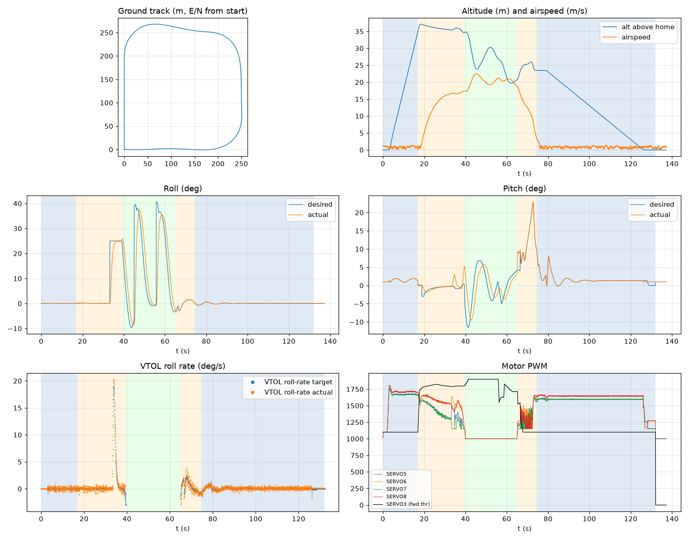

# Validation: indi_calm_s1

Log: `/home/trananhduy/quadplane-indi/rework/runs/indi_calm_s1/flight.BIN`  
Mission completed (landed + disarmed): **True**

## Parameters read back from the log

| param | value |
|---|---|
| Q_ENABLE | 1.0 |
| Q_OPTIONS | 0.0 |
| Q_ASSIST_SPEED | 16.66666603088379 |
| AHRS_EKF_TYPE | 10.0 |
| SIM_WIND_SPD | 0.0 |
| AIRSPEED_CRUISE | 20.83333396911621 |
| AIRSPEED_MIN | 16.0 |
| AIRSPEED_STALL | 16.66666603088379 |
| Q_A_RAT_RLL_P | 0.699999988079071 |
| Q_A_RAT_RLL_I | 0.699999988079071 |
| Q_A_RAT_RLL_D | 0.029999999329447746 |
| Q_A_RAT_RLL_FF | 0.0 |
| Q_A_RAT_PIT_P | 0.30000001192092896 |
| Q_A_RAT_PIT_I | 0.30000001192092896 |
| Q_A_RAT_PIT_D | 0.02500000037252903 |
| Q_A_RAT_PIT_FF | 0.0 |
| Q_A_RAT_YAW_P | 4.0 |
| Q_A_RAT_YAW_I | 0.4000000059604645 |
| Q_A_RAT_YAW_D | 0.10000000149011612 |
| Q_A_ANG_RLL_P | 4.5 |
| Q_A_ANG_PIT_P | 4.5 |
| Q_A_ANG_YAW_P | 1.520650029182434 |
| RLL_RATE_P | 0.14106599986553192 |
| RLL_RATE_I | 0.17587700486183167 |
| RLL_RATE_D | 0.0015910000074654818 |
| RLL_RATE_FF | 0.17587700486183167 |
| PTCH_RATE_P | 0.2803190052509308 |
| PTCH_RATE_I | 0.8886290192604065 |
| PTCH_RATE_D | 0.004360999912023544 |
| PTCH_RATE_FF | 0.8886290192604065 |
| Q_M_PWM_MIN | 1000.0 |
| Q_M_PWM_MAX | 2000.0 |
| Q_M_SPIN_MIN | 0.15000000596046448 |
| Q_M_THST_HOVER | 0.32763969898223877 |
| Q_INDI_ENABLE | 1.0 |
| Q_INDI_AXES | 27.0 |
| Q_INDI_FILT_HZ | 12.699999809265137 |
| Q_INDI_RLL_K | 13.5 |
| Q_INDI_PIT_K | 13.5 |
| Q_INDI_RLL_G | 56.70000076293945 |
| Q_INDI_PIT_G | 44.79999923706055 |
| Q_INDI_ACT_TC | 0.0 |
| Q_INDI_ACT_DLY | 0.004000000189989805 |
| Q_INDI_FW_RLL_G | 16.700000762939453 |
| Q_INDI_FW_PIT_G | 12.399999618530273 |
| Q_INDI_FW_TC | 0.009999999776482582 |
| Q_INDI_FW_RLL_K | 10.5 |
| Q_INDI_FW_PIT_K | 10.5 |

## Events (s from log start)

- arm: -0.0
- transition_start: 16.9
- transition_done: 39.3
- back_transition: 64.9
- position2: 74.4
- land_complete: 132.0
- disarm: 132.0

## Phases

| phase | start | end | dur (s) | INDI on motors (% time) | INDI on surfaces (% time) |
|---|---|---|---|---|---|
| hover_takeoff | -0.0 | 16.9 | 17.0 | 87.7 | 0.0 |
| transition | 16.9 | 39.3 | 22.4 | 100.0 | 0.0 |
| fixed_wing | 39.3 | 64.9 | 25.6 | - | 100.0 |
| back_transition | 64.9 | 74.4 | 9.5 | 97.2 | 0.0 |
| hover_land | 74.4 | 132.0 | 57.6 | 100.0 | 0.0 |

## Attitude tracking (desired - actual, deg)

| phase | roll RMS | roll max | pitch RMS | pitch max | yaw RMS | yaw max |
|---|---|---|---|---|---|---|
| hover_takeoff | 0.02 | 0.05 | 0.06 | 0.42 | 0.05 | 0.10 |
| transition | 4.23 | 24.88 | 1.11 | 4.51 | - | - |
| fixed_wing | 11.85 | 47.33 | 3.96 | 10.44 | - | - |
| back_transition | 0.48 | 1.59 | 1.85 | 5.30 | - | - |
| hover_land | 0.03 | 0.20 | 0.26 | 1.00 | 0.08 | 0.35 |

## VTOL rate loop (PIQx target - actual, deg/s)

| phase | roll RMS | pitch RMS | yaw RMS | roll peak Hz | roll >5 Hz share / RMS (deg/s) | pitch peak Hz | pitch >5 Hz share / RMS (deg/s) |
|---|---|---|---|---|---|---|---|
| hover_takeoff | 0.29 | 0.64 | 0.18 | 2.36 | 0.46 / 0.182 | 12.24 | 0.58 / 0.422 |
| transition | 0.79 | 2.43 | 2.51 | 0.04 | 0.00 / 0.121 | 0.04 | 0.02 / 0.305 |
| back_transition | 0.76 | 5.26 | 1.50 | 0.09 | 0.01 / 0.129 | 0.09 | 0.01 / 0.393 |
| hover_land | 0.31 | 1.45 | 0.18 | 0.09 | 0.39 / 0.250 | 12.22 | 0.64 / 0.474 |

## VTOL height and motors

| phase | alt err RMS (m) | alt err max (m) | climb err RMS (m/s) | motor mean (0-1) | motor max | % any motor at max | % any motor at min |
|---|---|---|---|---|---|---|---|
| hover_takeoff | 0.18 | 0.77 | 0.32 | [0.59, 0.626, 0.586, 0.623] | [0.762, 0.811, 0.754, 0.808] | 0.0 | 12.74 |
| transition | 0.34 | 1.48 | 0.26 | [0.417, 0.566, 0.371, 0.555] | [0.673, 0.703, 0.666, 0.708] | 0.0 | 17.32 |
| back_transition | 1.86 | 2.50 | 2.13 | [0.318, 0.355, 0.298, 0.323] | [0.62, 0.634, 0.635, 0.661] | 0.0 | 78.99 |
| hover_land | 0.53 | 2.50 | 0.67 | [0.557, 0.605, 0.555, 0.607] | [0.649, 0.669, 0.609, 0.667] | 0.0 | 9.1 |

## Fixed-wing

### transition

- airspeed min/mean/max: 0.0 / 12.6 / 17.4 m/s; TECS speed-demand tracking RMS 9.49 m/s
- nav roll/pitch tracking RMS (CTUN): 4.23 / 1.11 deg (max 24.88 / 4.51)
- FW rate loop (PIDR/PIDP) RMS: 0.78 / 2.43 deg/s
- TECS height error RMS / max: 1.13 / 2.13 m
- cross-track RMS / max: 16.63 / 65.98 m
- throttle mean/max: 85.6 / 90.6 % (0.0 % of samples at max)
- VTOL assist active: 100.0 % of time; lift motors above idle: 100.0 % of samples

### fixed_wing

- airspeed min/mean/max: 17.3 / 20.3 / 22.6 m/s; TECS speed-demand tracking RMS 1.74 m/s
- nav roll/pitch tracking RMS (CTUN): 11.85 / 3.96 deg (max 47.33 / 10.44)
- FW rate loop (PIDR/PIDP) RMS: 1.93 / 1.00 deg/s
- TECS height error RMS / max: 7.35 / 11.15 m
- cross-track RMS / max: 29.52 / 87.91 m
- throttle mean/max: 91.1 / 100.0 % (56.7 % of samples at max)
- VTOL assist active: 0.0 % of time; lift motors above idle: 2.34 % of samples

## Mode changes

- -0.0 s: QHOVER
- 2.0 s: AUTO

## Autopilot messages

- -0.0 s: Throttle armed
- -0.0 s: ArduPlane V4.8.0-dev (7fa89979)
- -0.0 s: 158c274630044e33ab0c21188889c480
- -0.0 s: Param space used: 77/3840
- -0.0 s: RC Protocol: UDP
- -0.0 s: New mission
- -0.0 s: New rally
- -0.0 s: New fence
- -0.0 s: QuadPlane Frame: QUAD/X
- -0.0 s: GPS 1: probing for u-blox at 230400 baud
- 2.0 s: Mission: 1 Takeoff
- 3.0 s: EKF3 IMU0 origin set
- 3.0 s: EKF3 IMU1 origin set
- 4.0 s: Weathervane Active: nose in
- 16.9 s: Mission: 2 WP
- 16.9 s: Transition started airspeed 0.0
- 32.8 s: Transition airspeed reached 16.7
- 33.1 s: Reached waypoint #2 dist 67m
- 33.1 s: Mission: 3 CondYaw
- 33.1 s: Mission: 4 WP
- 33.1 s: Skipping invalid cmd #115
- 33.1 s: Transition started airspeed 16.7
- 33.3 s: Transition airspeed reached 16.7
- 34.7 s: Transition started airspeed 16.7
- 36.3 s: Transition airspeed reached 16.7
- 39.3 s: Transition done
- 39.4 s: EKF3 IMU0 is using GPS
- 39.4 s: EKF3 IMU1 is using GPS
- 44.9 s: Reached waypoint #4 dist 90m
- 44.9 s: Mission: 5 WP
- 55.7 s: Reached waypoint #5 dist 85m
- 55.7 s: Mission: 6 Land
- 55.7 s: VTOL approach d=265.8
- 64.9 s: VTOL airbrake v=18.6 d=123 sd=124 h=20.7
- 66.4 s: VTOL position1 v=16.1 d=96.9 h=23.2 dc=19.0
- 74.3 s: Weathervane Active: nose in
- 74.4 s: VTOL position2 started v=3.3 d=9.9 h=23.5
- 78.5 s: Land descend started
- 78.6 s: Land final started
- 132.0 s: Land complete
- 132.0 s: Throttle disarmed

