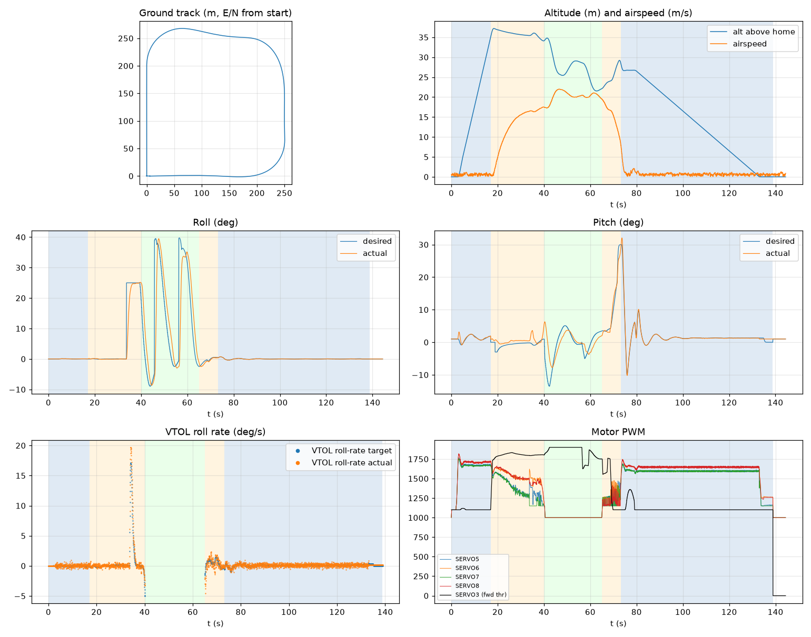

# Validation: check_calm_regress

Log: `/home/trananhduy/quadplane-indi/rework/runs/check_calm_regress/flight.BIN`  
Mission completed (landed + disarmed): **True**

## Parameters read back from the log

| param | value |
|---|---|
| Q_ENABLE | 1.0 |
| Q_OPTIONS | 0.0 |
| Q_ASSIST_SPEED | 16.66666603088379 |
| AHRS_EKF_TYPE | 10.0 |
| SIM_WIND_SPD | 0.0 |
| AIRSPEED_CRUISE | 20.83333396911621 |
| AIRSPEED_MIN | 16.0 |
| AIRSPEED_STALL | 16.66666603088379 |
| Q_A_RAT_RLL_P | 0.699999988079071 |
| Q_A_RAT_RLL_I | 0.699999988079071 |
| Q_A_RAT_RLL_D | 0.029999999329447746 |
| Q_A_RAT_RLL_FF | 0.0 |
| Q_A_RAT_PIT_P | 0.30000001192092896 |
| Q_A_RAT_PIT_I | 0.30000001192092896 |
| Q_A_RAT_PIT_D | 0.02500000037252903 |
| Q_A_RAT_PIT_FF | 0.0 |
| Q_A_RAT_YAW_P | 4.0 |
| Q_A_RAT_YAW_I | 0.4000000059604645 |
| Q_A_RAT_YAW_D | 0.10000000149011612 |
| Q_A_ANG_RLL_P | 4.5 |
| Q_A_ANG_PIT_P | 4.5 |
| Q_A_ANG_YAW_P | 1.520650029182434 |
| RLL_RATE_P | 0.14106599986553192 |
| RLL_RATE_I | 0.17587700486183167 |
| RLL_RATE_D | 0.0015910000074654818 |
| RLL_RATE_FF | 0.17587700486183167 |
| PTCH_RATE_P | 0.2803190052509308 |
| PTCH_RATE_I | 0.8886290192604065 |
| PTCH_RATE_D | 0.004360999912023544 |
| PTCH_RATE_FF | 0.8886290192604065 |
| Q_M_PWM_MIN | 1000.0 |
| Q_M_PWM_MAX | 2000.0 |
| Q_M_SPIN_MIN | 0.15000000596046448 |
| Q_M_THST_HOVER | 0.3035428524017334 |
| Q_INDI_ENABLE | None |
| Q_INDI_AXES | None |
| Q_INDI_FILT_HZ | None |
| Q_INDI_RLL_K | None |
| Q_INDI_PIT_K | None |
| Q_INDI_RLL_G | None |
| Q_INDI_PIT_G | None |
| Q_INDI_ACT_TC | None |
| Q_INDI_ACT_DLY | None |
| Q_INDI_FW_RLL_G | None |
| Q_INDI_FW_PIT_G | None |
| Q_INDI_FW_TC | None |
| Q_INDI_FW_RLL_K | None |
| Q_INDI_FW_PIT_K | None |

## Events (s from log start)

- arm: -0.0
- transition_start: 17.0
- transition_done: 40.1
- back_transition: 65.0
- position2: 73.2
- land_complete: 138.9
- disarm: 138.9

## Phases

| phase | start | end | dur (s) |
|---|---|---|---|
| hover_takeoff | -0.0 | 17.0 | 17.0 |
| transition | 17.0 | 40.1 | 23.1 |
| fixed_wing | 40.1 | 65.0 | 24.9 |
| back_transition | 65.0 | 73.2 | 8.2 |
| hover_land | 73.2 | 138.9 | 65.7 |

## Attitude tracking (desired - actual, deg)

| phase | roll RMS | roll max | pitch RMS | pitch max | yaw RMS | yaw max |
|---|---|---|---|---|---|---|
| hover_takeoff | 0.01 | 0.04 | 0.54 | 2.62 | 0.05 | 0.09 |
| transition | 4.07 | 25.00 | 1.52 | 4.62 | - | - |
| fixed_wing | 11.38 | 45.01 | 4.00 | 12.86 | - | - |
| back_transition | 0.50 | 1.45 | 1.77 | 3.87 | - | - |
| hover_land | 0.03 | 0.09 | 0.45 | 3.29 | 0.07 | 0.26 |

## VTOL rate loop (PIQx target - actual, deg/s)

| phase | roll RMS | pitch RMS | yaw RMS | roll peak Hz | roll >5 Hz share / RMS (deg/s) | pitch peak Hz | pitch >5 Hz share / RMS (deg/s) |
|---|---|---|---|---|---|---|---|
| hover_takeoff | 0.24 | 2.71 | 0.17 | 15.62 | 0.80 / 0.197 | 0.10 | 0.14 / 0.388 |
| transition | 0.74 | 2.73 | 2.46 | 0.04 | 0.00 / 0.146 | 0.04 | 0.01 / 0.253 |
| back_transition | 0.88 | 4.59 | 1.41 | 0.31 | 0.01 / 0.126 | 0.10 | 0.01 / 0.355 |
| hover_land | 0.23 | 2.29 | 0.18 | 12.21 | 0.84 / 0.199 | 12.21 | 0.47 / 0.492 |

## VTOL height and motors

| phase | alt err RMS (m) | alt err max (m) | climb err RMS (m/s) | motor mean (0-1) | motor max | % any motor at max | % any motor at min |
|---|---|---|---|---|---|---|---|
| hover_takeoff | 0.18 | 0.78 | 0.32 | [0.589, 0.624, 0.585, 0.621] | [0.766, 0.818, 0.751, 0.819] | 0.0 | 12.94 |
| transition | 0.35 | 1.23 | 0.28 | [0.392, 0.531, 0.354, 0.525] | [0.683, 0.721, 0.667, 0.724] | 0.0 | 23.7 |
| back_transition | 1.82 | 2.50 | 2.73 | [0.242, 0.257, 0.215, 0.212] | [0.47, 0.475, 0.449, 0.424] | 0.0 | 98.05 |
| hover_land | 0.50 | 2.50 | 0.64 | [0.561, 0.615, 0.559, 0.615] | [0.69, 0.747, 0.689, 0.746] | 0.0 | 7.8 |

## Fixed-wing

### transition

- airspeed min/mean/max: 0.2 / 12.5 / 17.5 m/s; TECS speed-demand tracking RMS 9.56 m/s
- nav roll/pitch tracking RMS (CTUN): 4.07 / 1.51 deg (max 25.00 / 4.62)
- FW rate loop (PIDR/PIDP) RMS: 0.72 / 2.74 deg/s
- TECS height error RMS / max: 1.13 / 2.16 m
- cross-track RMS / max: 16.12 / 64.64 m
- throttle mean/max: 86.3 / 91.7 % (0.0 % of samples at max)
- VTOL assist active: 100.0 % of time; lift motors above idle: 100.0 % of samples

### fixed_wing

- airspeed min/mean/max: 17.2 / 20.3 / 22.0 m/s; TECS speed-demand tracking RMS 1.68 m/s
- nav roll/pitch tracking RMS (CTUN): 11.38 / 4.00 deg (max 45.01 / 12.86)
- FW rate loop (PIDR/PIDP) RMS: 6.29 / 2.40 deg/s
- TECS height error RMS / max: 6.86 / 9.57 m
- cross-track RMS / max: 28.74 / 84.92 m
- throttle mean/max: 93.0 / 100.0 % (56.6 % of samples at max)
- VTOL assist active: 0.0 % of time; lift motors above idle: 1.45 % of samples

## Mode changes

- -0.0 s: QHOVER
- 2.0 s: AUTO

## Autopilot messages

- -0.0 s: Throttle armed
- -0.0 s: ArduPlane V4.8.0-dev (9eebb043)
- -0.0 s: 158c274630044e33ab0c21188889c480
- -0.0 s: Param space used: 69/3840
- -0.0 s: RC Protocol: UDP
- -0.0 s: New mission
- -0.0 s: New rally
- -0.0 s: New fence
- -0.0 s: QuadPlane Frame: QUAD/X
- -0.0 s: GPS 1: probing for u-blox at 230400 baud
- 2.0 s: Mission: 1 Takeoff
- 3.0 s: EKF3 IMU1 origin set
- 3.0 s: EKF3 IMU0 origin set
- 4.0 s: Weathervane Active: nose in
- 17.0 s: Mission: 2 WP
- 17.0 s: Transition started airspeed 0.6
- 33.6 s: Reached waypoint #2 dist 66m
- 33.6 s: Mission: 3 CondYaw
- 33.6 s: Mission: 4 WP
- 33.6 s: Skipping invalid cmd #115
- 37.1 s: Transition airspeed reached 16.7
- 40.1 s: Transition done
- 40.2 s: EKF3 IMU1 is using GPS
- 40.2 s: EKF3 IMU0 is using GPS
- 45.7 s: Reached waypoint #4 dist 87m
- 45.7 s: Mission: 5 WP
- 56.3 s: Reached waypoint #5 dist 83m
- 56.3 s: Mission: 6 Land
- 56.3 s: VTOL approach d=264.5
- 65.0 s: VTOL airbrake v=19.4 d=132 sd=133 h=22.1
- 68.6 s: VTOL position1 v=16.6 d=68.8 h=24.0 dc=16.6
- 73.2 s: VTOL position2 started v=7.8 d=9.6 h=28.5
- 75.0 s: Weathervane Active: nose in
- 79.0 s: Land descend started
- 79.1 s: Land final started
- 138.9 s: Land complete
- 138.9 s: Throttle disarmed

