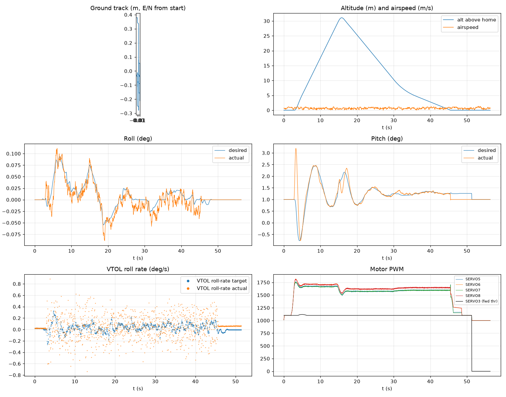

# Validation: failed_gcs_failsafe_01

Log: `/home/trananhduy/quadplane-indi/rework/runs/failed_gcs_failsafe_01/flight.BIN`  
Mission completed (landed + disarmed): **False**

## Parameters read back from the log

| param | value |
|---|---|
| Q_ENABLE | 1.0 |
| Q_OPTIONS | 0.0 |
| Q_ASSIST_SPEED | 16.66666603088379 |
| AHRS_EKF_TYPE | 10.0 |
| SIM_WIND_SPD | 0.0 |
| AIRSPEED_CRUISE | 20.83333396911621 |
| AIRSPEED_MIN | 16.0 |
| AIRSPEED_STALL | 16.66666603088379 |
| Q_A_RAT_RLL_P | 0.699999988079071 |
| Q_A_RAT_RLL_I | 0.699999988079071 |
| Q_A_RAT_RLL_D | 0.029999999329447746 |
| Q_A_RAT_RLL_FF | 0.0 |
| Q_A_RAT_PIT_P | 0.30000001192092896 |
| Q_A_RAT_PIT_I | 0.30000001192092896 |
| Q_A_RAT_PIT_D | 0.02500000037252903 |
| Q_A_RAT_PIT_FF | 0.0 |
| Q_A_RAT_YAW_P | 4.0 |
| Q_A_RAT_YAW_I | 0.4000000059604645 |
| Q_A_RAT_YAW_D | 0.10000000149011612 |
| Q_A_ANG_RLL_P | 4.5 |
| Q_A_ANG_PIT_P | 4.5 |
| Q_A_ANG_YAW_P | 1.520650029182434 |
| RLL_RATE_P | 0.14106599986553192 |
| RLL_RATE_I | 0.17587700486183167 |
| RLL_RATE_D | 0.0015910000074654818 |
| RLL_RATE_FF | 0.17587700486183167 |
| PTCH_RATE_P | 0.2803190052509308 |
| PTCH_RATE_I | 0.8886290192604065 |
| PTCH_RATE_D | 0.004360999912023544 |
| PTCH_RATE_FF | 0.8886290192604065 |
| Q_M_PWM_MIN | 1000.0 |
| Q_M_PWM_MAX | 2000.0 |
| Q_M_SPIN_MIN | 0.15000000596046448 |
| Q_M_THST_HOVER | 0.29800230264663696 |

## Events (s from log start)

- arm: -
- transition_start: -
- transition_done: -
- back_transition: -
- position2: -
- land_complete: 51.3
- disarm: -

## Phases

| phase | start | end | dur (s) |
|---|---|---|---|

## Attitude tracking (desired - actual, deg)

| phase | roll RMS | roll max | pitch RMS | pitch max | yaw RMS | yaw max |
|---|---|---|---|---|---|---|

## VTOL rate loop (PIQx target - actual, deg/s)

| phase | roll RMS | pitch RMS | yaw RMS | roll peak Hz | roll >5 Hz power | pitch peak Hz | pitch >5 Hz power |
|---|---|---|---|---|---|---|---|

## VTOL height and motors

| phase | alt err RMS (m) | alt err max (m) | climb err RMS (m/s) | motor mean (0-1) | motor max | % any motor at max | % any motor at min |
|---|---|---|---|---|---|---|---|

## Fixed-wing

## Mode changes

- -0.0 s: 18
- 2.0 s: 10
- 14.5 s: 20

## Autopilot messages

- -0.0 s: Throttle armed
- -0.0 s: ArduPlane V4.8.0-dev (9f648cca)
- -0.0 s: 158c274630044e33ab0c21188889c480
- -0.0 s: Param space used: 69/3840
- -0.0 s: RC Protocol: UDP
- -0.0 s: New mission
- -0.0 s: New rally
- -0.0 s: New fence
- -0.0 s: QuadPlane Frame: QUAD/X
- -0.0 s: GPS 1: probing for u-blox at 230400 baud
- 2.0 s: Mission: 1 Takeoff
- 3.0 s: EKF3 IMU1 origin set
- 3.0 s: EKF3 IMU0 origin set
- 4.0 s: Weathervane Active: nose in
- 14.5 s: GCS Failsafe On: switched to QLand
- 50.2 s: EKF3 IMU1 is using GPS
- 50.2 s: EKF3 IMU0 is using GPS
- 51.3 s: Land complete
- 51.3 s: Throttle disarmed

