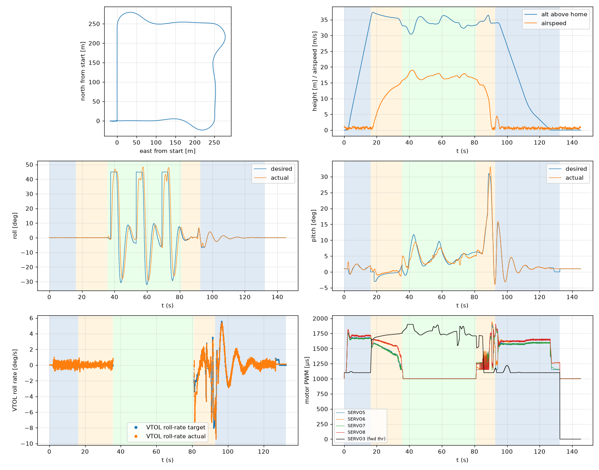

# Validation: fast_test_pid_calm

Log: `/home/trananhduy/quadplane-indi/rework/runs/fast_test_pid_calm/flight.BIN`  
Mission completed (landed + disarmed): **True**

## Parameters read back from the log

| param | value |
|---|---|
| Q_ENABLE | 1.0 |
| Q_OPTIONS | 0.0 |
| Q_ASSIST_SPEED | 13.0 |
| AHRS_EKF_TYPE | 10.0 |
| SIM_WIND_SPD | 0.0 |
| AIRSPEED_CRUISE | 17.0 |
| AIRSPEED_MIN | 14.0 |
| AIRSPEED_STALL | 12.0 |
| Q_A_RAT_RLL_P | 0.699999988079071 |
| Q_A_RAT_RLL_I | 0.699999988079071 |
| Q_A_RAT_RLL_D | 0.029999999329447746 |
| Q_A_RAT_RLL_FF | 0.0 |
| Q_A_RAT_PIT_P | 0.30000001192092896 |
| Q_A_RAT_PIT_I | 0.30000001192092896 |
| Q_A_RAT_PIT_D | 0.02500000037252903 |
| Q_A_RAT_PIT_FF | 0.0 |
| Q_A_RAT_YAW_P | 4.0 |
| Q_A_RAT_YAW_I | 0.4000000059604645 |
| Q_A_RAT_YAW_D | 0.10000000149011612 |
| Q_A_ANG_RLL_P | 4.5 |
| Q_A_ANG_PIT_P | 4.5 |
| Q_A_ANG_YAW_P | 1.520650029182434 |
| RLL_RATE_P | 0.14106599986553192 |
| RLL_RATE_I | 0.17587700486183167 |
| RLL_RATE_D | 0.0015910000074654818 |
| RLL_RATE_FF | 0.17587700486183167 |
| PTCH_RATE_P | 0.2803190052509308 |
| PTCH_RATE_I | 0.8886290192604065 |
| PTCH_RATE_D | 0.004360999912023544 |
| PTCH_RATE_FF | 0.8886290192604065 |
| Q_M_PWM_MIN | 1000.0 |
| Q_M_PWM_MAX | 2000.0 |
| Q_M_SPIN_MIN | 0.15000000596046448 |
| Q_M_THST_HOVER | 0.3109177052974701 |
| Q_INDI_ENABLE | 0.0 |
| Q_INDI_AXES | None |
| Q_INDI_FILT_HZ | None |
| Q_INDI_RLL_K | None |
| Q_INDI_PIT_K | None |
| Q_INDI_RLL_G | None |
| Q_INDI_PIT_G | None |
| Q_INDI_ACT_TC | None |
| Q_INDI_ACT_DLY | None |
| Q_INDI_FW_RLL_G | None |
| Q_INDI_FW_PIT_G | None |
| Q_INDI_FW_TC | None |
| Q_INDI_FW_RLL_K | None |
| Q_INDI_FW_PIT_K | None |

## Events (s from log start)

- arm: -0.0
- transition_start: 16.2
- transition_done: 35.5
- back_transition: 80.9
- position2: 92.7
- land_complete: 132.4
- disarm: 132.4

## Phases

| phase | start | end | dur (s) | INDI on motors (% time) | INDI on surfaces (% time) |
|---|---|---|---|---|---|
| hover_takeoff | -0.0 | 16.2 | 16.2 | - | - |
| transition | 16.2 | 35.5 | 19.3 | - | - |
| fixed_wing | 35.5 | 80.9 | 45.4 | - | - |
| back_transition | 80.9 | 92.7 | 11.8 | - | - |
| hover_land | 92.7 | 132.4 | 39.7 | - | - |

## Attitude tracking (desired - actual, deg)

| phase | roll RMS | roll max | pitch RMS | pitch max | yaw RMS | yaw max |
|---|---|---|---|---|---|---|
| hover_takeoff | 0.02 | 0.05 | 0.55 | 2.67 | 0.06 | 0.10 |
| transition | 0.06 | 0.24 | 1.18 | 3.89 | - | - |
| fixed_wing | 15.96 | 51.80 | 1.66 | 5.18 | - | - |
| back_transition | 1.30 | 3.58 | 1.43 | 4.20 | - | - |
| hover_land | 0.33 | 2.43 | 0.34 | 1.00 | 1.73 | 9.71 |

## VTOL rate loop (PIQx target - actual, deg/s)

| phase | roll RMS | pitch RMS | yaw RMS | roll peak Hz | roll >5 Hz share / RMS (deg/s) | pitch peak Hz | pitch >5 Hz share / RMS (deg/s) |
|---|---|---|---|---|---|---|---|
| hover_takeoff | 0.25 | 2.77 | 0.18 | 18.67 | 0.79 / 0.218 | 0.12 | 0.19 / 0.404 |
| transition | 0.23 | 1.81 | 0.28 | 0.65 | 0.43 / 0.118 | 0.13 | 0.21 / 0.205 |
| back_transition | 1.22 | 5.40 | 6.99 | 0.07 | 0.00 / 0.211 | 0.07 | 0.00 / 0.336 |
| hover_land | 0.31 | 1.62 | 5.80 | 0.10 | 0.07 / 0.189 | 0.10 | 0.28 / 0.529 |

## VTOL height and motors

| phase | alt err RMS (m) | alt err max (m) | climb err RMS (m/s) | motor mean (0-1) | motor max | % any motor at max | % any motor at min |
|---|---|---|---|---|---|---|---|
| hover_takeoff | 0.18 | 0.77 | 0.32 | [0.614, 0.651, 0.609, 0.647] | [0.762, 0.818, 0.754, 0.818] | 0.0 | 8.62 |
| transition | 0.42 | 2.22 | 0.33 | [0.465, 0.568, 0.458, 0.571] | [0.672, 0.717, 0.669, 0.722] | 0.0 | 5.59 |
| back_transition | 1.25 | 2.50 | 1.52 | [0.36, 0.374, 0.332, 0.337] | [0.916, 0.95, 0.758, 0.813] | 0.0 | 74.24 |
| hover_land | 0.63 | 2.50 | 0.81 | [0.508, 0.566, 0.532, 0.588] | [0.702, 0.726, 0.852, 0.904] | 0.0 | 16.23 |

## Fixed-wing

### transition

- airspeed min/mean/max: 0.1 / 9.8 / 15.6 m/s; TECS speed-demand tracking RMS 8.25 m/s
- nav roll/pitch tracking RMS (CTUN): 0.06 / 1.18 deg (max 0.23 / 3.88)
- FW rate loop (PIDR/PIDP) RMS: 0.23 / 1.82 deg/s
- TECS height error RMS / max: 1.24 / 2.21 m
- cross-track RMS / max: 0.00 / 0.00 m
- throttle mean/max: 75.6 / 81.6 % (0.0 % of samples at max)
- VTOL assist active: 100.0 % of time; lift motors above idle: 100.0 % of samples

### fixed_wing

- airspeed min/mean/max: 15.7 / 17.0 / 19.0 m/s; TECS speed-demand tracking RMS 1.08 m/s
- nav roll/pitch tracking RMS (CTUN): 15.84 / 1.66 deg (max 51.79 / 5.15)
- FW rate loop (PIDR/PIDP) RMS: 7.05 / 2.10 deg/s
- TECS height error RMS / max: 1.85 / 4.60 m
- cross-track RMS / max: 12.40 / 28.79 m
- throttle mean/max: 84.9 / 100.0 % (8.1 % of samples at max)
- VTOL assist active: 0.0 % of time; lift motors above idle: 1.23 % of samples

## Mode changes

- 0.0 s: QHOVER
- 1.2 s: AUTO

## Autopilot messages

- -0.0 s: Throttle armed
- 0.0 s: ArduPlane V4.8.0-dev (7fa89979)
- 0.0 s: 158c274630044e33ab0c21188889c480
- 0.0 s: Param space used: 85/3840
- 0.0 s: RC Protocol: UDP
- 0.0 s: New mission
- 0.0 s: New rally
- 0.0 s: New fence
- 0.0 s: QuadPlane Frame: QUAD/X
- 0.0 s: GPS 1: probing for u-blox at 230400 baud
- 1.2 s: Mission: 1 Takeoff
- 3.2 s: Weathervane Active: nose in
- 16.2 s: Mission: 2 WP
- 16.2 s: Transition started airspeed 0.9
- 32.5 s: Transition airspeed reached 14.0
- 35.5 s: Transition done
- 37.5 s: Reached waypoint #2 dist 25m
- 37.5 s: Mission: 3 CondYaw
- 37.5 s: Mission: 4 WP
- 37.5 s: Skipping invalid cmd #115
- 53.2 s: Reached waypoint #4 dist 24m
- 53.2 s: Mission: 5 WP
- 69.1 s: Reached waypoint #5 dist 25m
- 69.1 s: Mission: 6 Land
- 69.1 s: VTOL approach d=252.8
- 80.9 s: VTOL airbrake v=16.1 d=96 sd=97 h=33.3
- 85.0 s: VTOL position1 v=14.3 d=36.4 h=34.5 dc=11.9
- 87.7 s: VTOL Overshoot d=0.1 cs=-5.8 yerr=120.9
- 92.7 s: VTOL position2 started v=5.0 d=9.5 h=33.9
- 94.5 s: Land descend started
- 94.7 s: Weathervane Active: nose in
- 116.6 s: Land final started
- 132.4 s: Land complete
- 132.4 s: Throttle disarmed

