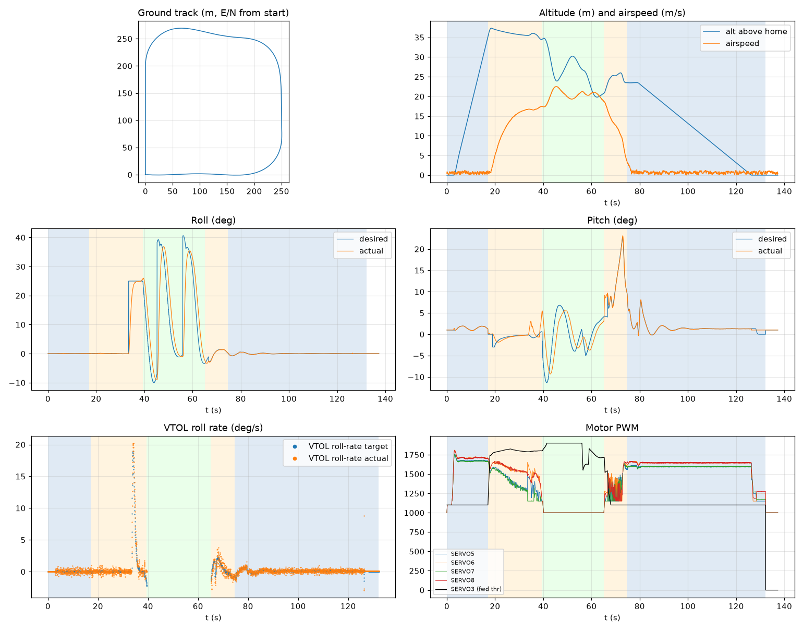

# Validation: indi_calm_test

Log: `/home/trananhduy/quadplane-indi/rework/runs/indi_calm_test/flight.BIN`  
Mission completed (landed + disarmed): **True**

## Parameters read back from the log

| param | value |
|---|---|
| Q_ENABLE | 1.0 |
| Q_OPTIONS | 0.0 |
| Q_ASSIST_SPEED | 16.66666603088379 |
| AHRS_EKF_TYPE | 10.0 |
| SIM_WIND_SPD | 0.0 |
| AIRSPEED_CRUISE | 20.83333396911621 |
| AIRSPEED_MIN | 16.0 |
| AIRSPEED_STALL | 16.66666603088379 |
| Q_A_RAT_RLL_P | 0.699999988079071 |
| Q_A_RAT_RLL_I | 0.699999988079071 |
| Q_A_RAT_RLL_D | 0.029999999329447746 |
| Q_A_RAT_RLL_FF | 0.0 |
| Q_A_RAT_PIT_P | 0.30000001192092896 |
| Q_A_RAT_PIT_I | 0.30000001192092896 |
| Q_A_RAT_PIT_D | 0.02500000037252903 |
| Q_A_RAT_PIT_FF | 0.0 |
| Q_A_RAT_YAW_P | 4.0 |
| Q_A_RAT_YAW_I | 0.4000000059604645 |
| Q_A_RAT_YAW_D | 0.10000000149011612 |
| Q_A_ANG_RLL_P | 4.5 |
| Q_A_ANG_PIT_P | 4.5 |
| Q_A_ANG_YAW_P | 1.520650029182434 |
| RLL_RATE_P | 0.14106599986553192 |
| RLL_RATE_I | 0.17587700486183167 |
| RLL_RATE_D | 0.0015910000074654818 |
| RLL_RATE_FF | 0.17587700486183167 |
| PTCH_RATE_P | 0.2803190052509308 |
| PTCH_RATE_I | 0.8886290192604065 |
| PTCH_RATE_D | 0.004360999912023544 |
| PTCH_RATE_FF | 0.8886290192604065 |
| Q_M_PWM_MIN | 1000.0 |
| Q_M_PWM_MAX | 2000.0 |
| Q_M_SPIN_MIN | 0.15000000596046448 |
| Q_M_THST_HOVER | 0.3276885151863098 |
| Q_INDI_ENABLE | 1.0 |
| Q_INDI_AXES | 27.0 |
| Q_INDI_FILT_HZ | 12.699999809265137 |
| Q_INDI_RLL_K | 13.5 |
| Q_INDI_PIT_K | 13.5 |
| Q_INDI_RLL_G | 56.70000076293945 |
| Q_INDI_PIT_G | 44.79999923706055 |
| Q_INDI_ACT_TC | 0.0 |
| Q_INDI_ACT_DLY | 0.004000000189989805 |
| Q_INDI_FW_RLL_G | 16.700000762939453 |
| Q_INDI_FW_PIT_G | 12.399999618530273 |
| Q_INDI_FW_TC | 0.009999999776482582 |
| Q_INDI_FW_RLL_K | 10.5 |
| Q_INDI_FW_PIT_K | 10.5 |

## Events (s from log start)

- arm: -0.0
- transition_start: 17.0
- transition_done: 39.4
- back_transition: 65.1
- position2: 74.6
- land_complete: 132.2
- disarm: 132.2

## Phases

| phase | start | end | dur (s) | INDI on motors (% time) | INDI on surfaces (% time) |
|---|---|---|---|---|---|
| hover_takeoff | -0.0 | 17.0 | 17.0 | 87.7 | 0.0 |
| transition | 17.0 | 39.5 | 22.4 | 100.0 | 0.0 |
| fixed_wing | 39.5 | 65.1 | 25.7 | - | 100.0 |
| back_transition | 65.1 | 74.6 | 9.5 | 97.2 | 0.0 |
| hover_land | 74.6 | 132.2 | 57.6 | 100.0 | 0.0 |

## Attitude tracking (desired - actual, deg)

| phase | roll RMS | roll max | pitch RMS | pitch max | yaw RMS | yaw max |
|---|---|---|---|---|---|---|
| hover_takeoff | 0.01 | 0.04 | 0.07 | 0.86 | 0.05 | 0.10 |
| transition | 4.24 | 25.00 | 1.13 | 4.60 | - | - |
| fixed_wing | 11.85 | 47.43 | 3.93 | 10.55 | - | - |
| back_transition | 0.46 | 1.53 | 1.82 | 5.21 | - | - |
| hover_land | 0.03 | 0.19 | 0.26 | 1.00 | 0.08 | 0.35 |

## VTOL rate loop (PIQx target - actual, deg/s)

| phase | roll RMS | pitch RMS | yaw RMS | roll peak Hz | roll >5 Hz share / RMS (deg/s) | pitch peak Hz | pitch >5 Hz share / RMS (deg/s) |
|---|---|---|---|---|---|---|---|
| hover_takeoff | 0.29 | 0.63 | 0.17 | 4.65 | 0.56 / 0.213 | 12.24 | 0.57 / 0.422 |
| transition | 0.80 | 2.46 | 2.54 | 0.04 | 0.00 / 0.127 | 0.04 | 0.02 / 0.296 |
| back_transition | 0.75 | 5.28 | 1.55 | 0.09 | 0.01 / 0.152 | 0.09 | 0.01 / 0.393 |
| hover_land | 0.36 | 1.44 | 0.20 | 0.09 | 0.38 / 0.262 | 12.22 | 0.62 / 0.468 |

## VTOL height and motors

| phase | alt err RMS (m) | alt err max (m) | climb err RMS (m/s) | motor mean (0-1) | motor max | % any motor at max | % any motor at min |
|---|---|---|---|---|---|---|---|
| hover_takeoff | 0.18 | 0.77 | 0.31 | [0.59, 0.625, 0.585, 0.622] | [0.76, 0.811, 0.754, 0.806] | 0.0 | 12.88 |
| transition | 0.38 | 1.56 | 0.27 | [0.41, 0.558, 0.366, 0.548] | [0.665, 0.706, 0.664, 0.708] | 0.0 | 20.54 |
| back_transition | 1.86 | 2.50 | 2.13 | [0.316, 0.354, 0.297, 0.322] | [0.622, 0.636, 0.636, 0.662] | 0.0 | 79.41 |
| hover_land | 0.53 | 2.50 | 0.68 | [0.556, 0.604, 0.557, 0.608] | [0.642, 0.668, 0.609, 0.666] | 0.0 | 9.03 |

## Fixed-wing

### transition

- airspeed min/mean/max: 0.4 / 12.7 / 17.5 m/s; TECS speed-demand tracking RMS 9.47 m/s
- nav roll/pitch tracking RMS (CTUN): 4.24 / 1.13 deg (max 25.00 / 4.60)
- FW rate loop (PIDR/PIDP) RMS: 0.78 / 2.46 deg/s
- TECS height error RMS / max: 1.17 / 2.20 m
- cross-track RMS / max: 16.21 / 64.75 m
- throttle mean/max: 85.6 / 90.6 % (0.0 % of samples at max)
- VTOL assist active: 100.0 % of time; lift motors above idle: 100.0 % of samples

### fixed_wing

- airspeed min/mean/max: 17.3 / 20.3 / 22.5 m/s; TECS speed-demand tracking RMS 1.72 m/s
- nav roll/pitch tracking RMS (CTUN): 11.85 / 3.93 deg (max 47.43 / 10.55)
- FW rate loop (PIDR/PIDP) RMS: 1.93 / 0.93 deg/s
- TECS height error RMS / max: 7.31 / 11.11 m
- cross-track RMS / max: 29.55 / 87.76 m
- throttle mean/max: 91.1 / 100.0 % (57.3 % of samples at max)
- VTOL assist active: 0.0 % of time; lift motors above idle: 2.18 % of samples

## Mode changes

- 0.0 s: QHOVER
- 2.0 s: AUTO

## Autopilot messages

- -0.0 s: Throttle armed
- 0.0 s: ArduPlane V4.8.0-dev (7fa89979)
- 0.0 s: 158c274630044e33ab0c21188889c480
- 0.0 s: Param space used: 77/3840
- 0.0 s: RC Protocol: UDP
- 0.0 s: New mission
- 0.0 s: New rally
- 0.0 s: New fence
- 0.0 s: QuadPlane Frame: QUAD/X
- 0.0 s: GPS 1: probing for u-blox at 230400 baud
- 2.0 s: Mission: 1 Takeoff
- 3.0 s: EKF3 IMU0 origin set
- 3.0 s: EKF3 IMU1 origin set
- 4.0 s: Weathervane Active: nose in
- 17.0 s: Mission: 2 WP
- 17.0 s: Transition started airspeed 0.9
- 32.9 s: Transition airspeed reached 16.7
- 33.2 s: Transition started airspeed 16.7
- 33.3 s: Reached waypoint #2 dist 66m
- 33.3 s: Mission: 3 CondYaw
- 33.3 s: Mission: 4 WP
- 33.3 s: Skipping invalid cmd #115
- 33.4 s: Transition airspeed reached 16.7
- 35.2 s: Transition started airspeed 16.6
- 36.4 s: Transition airspeed reached 16.7
- 39.5 s: Transition done
- 39.6 s: EKF3 IMU0 is using GPS
- 39.6 s: EKF3 IMU1 is using GPS
- 45.1 s: Reached waypoint #4 dist 90m
- 45.1 s: Mission: 5 WP
- 55.9 s: Reached waypoint #5 dist 85m
- 55.9 s: Mission: 6 Land
- 55.9 s: VTOL approach d=265.8
- 65.1 s: VTOL airbrake v=18.6 d=123 sd=123 h=20.8
- 66.6 s: VTOL position1 v=16.1 d=97.2 h=23.2 dc=19.0
- 74.6 s: Weathervane Active: nose in
- 74.6 s: VTOL position2 started v=3.3 d=9.9 h=23.5
- 78.7 s: Land descend started
- 78.8 s: Land final started
- 132.2 s: Land complete
- 132.2 s: Throttle disarmed

