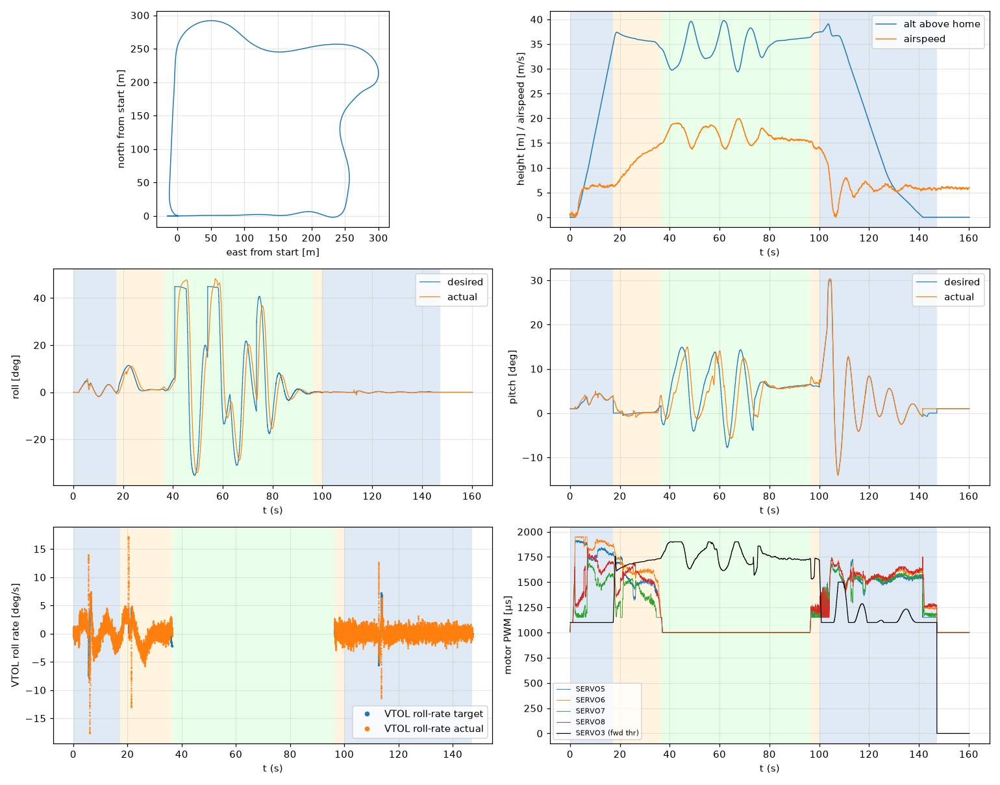

# Validation: indi_w6_s1

Log: `/home/trananhduy/quadplane-indi/rework/runs/noisy_wind/indi_w6_s1/flight.BIN`  
Mission completed (landed + disarmed): **True**

## Parameters read back from the log

| param | value |
|---|---|
| Q_ENABLE | 1.0 |
| Q_OPTIONS | 0.0 |
| Q_ASSIST_SPEED | 13.0 |
| AHRS_EKF_TYPE | 10.0 |
| SIM_WIND_SPD | 0.0 |
| AIRSPEED_CRUISE | 17.0 |
| AIRSPEED_MIN | 14.0 |
| AIRSPEED_STALL | 12.0 |
| Q_A_RAT_RLL_P | 0.699999988079071 |
| Q_A_RAT_RLL_I | 0.699999988079071 |
| Q_A_RAT_RLL_D | 0.029999999329447746 |
| Q_A_RAT_RLL_FF | 0.0 |
| Q_A_RAT_PIT_P | 0.30000001192092896 |
| Q_A_RAT_PIT_I | 0.30000001192092896 |
| Q_A_RAT_PIT_D | 0.02500000037252903 |
| Q_A_RAT_PIT_FF | 0.0 |
| Q_A_RAT_YAW_P | 4.0 |
| Q_A_RAT_YAW_I | 0.4000000059604645 |
| Q_A_RAT_YAW_D | 0.10000000149011612 |
| Q_A_ANG_RLL_P | 4.5 |
| Q_A_ANG_PIT_P | 4.5 |
| Q_A_ANG_YAW_P | 1.520650029182434 |
| RLL_RATE_P | 0.14106599986553192 |
| RLL_RATE_I | 0.17587700486183167 |
| RLL_RATE_D | 0.0015910000074654818 |
| RLL_RATE_FF | 0.17587700486183167 |
| PTCH_RATE_P | 0.2803190052509308 |
| PTCH_RATE_I | 0.8886290192604065 |
| PTCH_RATE_D | 0.004360999912023544 |
| PTCH_RATE_FF | 0.8886290192604065 |
| Q_M_PWM_MIN | 1000.0 |
| Q_M_PWM_MAX | 2000.0 |
| Q_M_SPIN_MIN | 0.15000000596046448 |
| Q_M_THST_HOVER | 0.304247111082077 |
| Q_INDI_ENABLE | 1.0 |
| Q_INDI_AXES | 27.0 |
| Q_INDI_FILT_HZ | 12.699999809265137 |
| Q_INDI_RLL_K | 13.5 |
| Q_INDI_PIT_K | 13.5 |
| Q_INDI_RLL_G | 56.70000076293945 |
| Q_INDI_PIT_G | 44.79999923706055 |
| Q_INDI_ACT_TC | 0.0 |
| Q_INDI_ACT_DLY | 0.004000000189989805 |
| Q_INDI_FW_RLL_G | 16.700000762939453 |
| Q_INDI_FW_PIT_G | 12.399999618530273 |
| Q_INDI_FW_TC | 0.009999999776482582 |
| Q_INDI_FW_RLL_K | 10.5 |
| Q_INDI_FW_PIT_K | 10.5 |

## Events (s from log start)

- arm: -0.0
- transition_start: 17.3
- transition_done: 36.4
- back_transition: 96.3
- position2: 100.1
- land_complete: 147.2
- disarm: 147.2

## Phases

| phase | start | end | dur (s) | INDI on motors (% time) | INDI on surfaces (% time) |
|---|---|---|---|---|---|
| hover_takeoff | -0.0 | 17.3 | 17.3 | 93.1 | 0.0 |
| transition | 17.3 | 36.4 | 19.1 | 100.0 | 0.0 |
| fixed_wing | 36.4 | 96.3 | 59.9 | - | 100.0 |
| back_transition | 96.3 | 100.1 | 3.7 | 92.9 | 0.1 |
| hover_land | 100.1 | 147.2 | 47.2 | 100.0 | 0.0 |

## Attitude tracking (desired - actual, deg)

| phase | roll RMS | roll max | pitch RMS | pitch max | yaw RMS | yaw max |
|---|---|---|---|---|---|---|
| hover_takeoff | 0.34 | 1.86 | 0.34 | 1.06 | 5.29 | 79.51 |
| transition | 1.75 | 3.67 | 0.77 | 2.92 | - | - |
| fixed_wing | 13.17 | 44.39 | 4.25 | 10.11 | - | - |
| back_transition | 0.19 | 0.34 | 1.05 | 1.82 | - | - |
| hover_land | 0.13 | 1.34 | 0.46 | 1.82 | 0.25 | 1.94 |

## VTOL rate loop (PIQx target - actual, deg/s)

| phase | roll RMS | pitch RMS | yaw RMS | roll peak Hz | roll >5 Hz share / RMS (deg/s) | pitch peak Hz | pitch >5 Hz share / RMS (deg/s) |
|---|---|---|---|---|---|---|---|
| hover_takeoff | 2.04 | 1.35 | 17.90 | 0.12 | 0.09 / 0.809 | 0.17 | 0.11 / 0.503 |
| transition | 1.73 | 1.65 | 2.14 | 0.04 | 0.10 / 0.720 | 0.04 | 0.06 / 0.258 |
| back_transition | 1.07 | 2.23 | 0.66 | 1.34 | 0.40 / 0.631 | 0.45 | 0.02 / 0.157 |
| hover_land | 1.26 | 2.78 | 0.84 | 1.20 | 0.41 / 0.667 | 0.11 | 0.02 / 0.970 |

## VTOL height and motors

| phase | alt err RMS (m) | alt err max (m) | climb err RMS (m/s) | motor mean (0-1) | motor max | % any motor at max | % any motor at min |
|---|---|---|---|---|---|---|---|
| hover_takeoff | 0.08 | 0.47 | 0.32 | [0.745, 0.813, 0.413, 0.545] | [0.915, 0.95, 0.76, 0.838] | 0.0 | 17.05 |
| transition | 0.27 | 1.28 | 0.20 | [0.52, 0.614, 0.36, 0.523] | [0.775, 0.86, 0.581, 0.701] | 0.0 | 13.42 |
| back_transition | 0.49 | 0.72 | 0.66 | [0.168, 0.212, 0.18, 0.224] | [0.248, 0.273, 0.249, 0.283] | 0.0 | 100.0 |
| hover_land | 0.73 | 2.50 | 0.91 | [0.467, 0.51, 0.475, 0.519] | [0.726, 0.754, 0.687, 0.75] | 0.0 | 20.1 |

## Fixed-wing

### transition

- airspeed min/mean/max: 6.2 / 11.1 / 14.9 m/s; TECS speed-demand tracking RMS 6.49 m/s
- nav roll/pitch tracking RMS (CTUN): 1.73 / 0.77 deg (max 3.63 / 2.91)
- FW rate loop (PIDR/PIDP) RMS: 1.72 / 1.65 deg/s
- TECS height error RMS / max: 1.21 / 2.29 m
- cross-track RMS / max: 0.00 / 0.00 m
- throttle mean/max: 72.6 / 82.3 % (0.0 % of samples at max)
- VTOL assist active: 100.0 % of time; lift motors above idle: 100.0 % of samples

### fixed_wing

- airspeed min/mean/max: 13.7 / 16.6 / 19.9 m/s; TECS speed-demand tracking RMS 1.58 m/s
- nav roll/pitch tracking RMS (CTUN): 13.06 / 4.22 deg (max 43.72 / 9.95)
- FW rate loop (PIDR/PIDP) RMS: 2.11 / 1.28 deg/s
- TECS height error RMS / max: 2.89 / 5.61 m
- cross-track RMS / max: 16.98 / 50.93 m
- throttle mean/max: 83.5 / 100.0 % (13.6 % of samples at max)
- VTOL assist active: 0.0 % of time; lift motors above idle: 1.0 % of samples

## Mode changes

- 0.0 s: QHOVER
- 1.1 s: AUTO

## Autopilot messages

- -0.0 s: Throttle armed
- 0.0 s: ArduPlane V4.8.0-dev (7fa89979)
- 0.0 s: 158c274630044e33ab0c21188889c480
- 0.0 s: Param space used: 77/3840
- 0.0 s: RC Protocol: UDP
- 0.0 s: New mission
- 0.0 s: New rally
- 0.0 s: New fence
- 0.0 s: QuadPlane Frame: QUAD/X
- 0.0 s: GPS 1: probing for u-blox at 230400 baud
- 1.1 s: Mission: 1 Takeoff
- 3.1 s: Weathervane Active: nose in
- 17.3 s: Mission: 2 WP
- 17.3 s: Transition started airspeed 6.3
- 33.4 s: Transition airspeed reached 14.0
- 36.4 s: Transition done
- 40.6 s: Reached waypoint #2 dist 26m
- 40.6 s: Mission: 3 CondYaw
- 40.6 s: Mission: 4 WP
- 40.6 s: Skipping invalid cmd #115
- 53.8 s: Reached waypoint #4 dist 25m
- 53.8 s: Mission: 5 WP
- 73.5 s: Reached waypoint #5 dist 25m
- 73.5 s: Mission: 6 Land
- 73.5 s: VTOL approach d=255.3
- 96.3 s: VTOL airbrake v=9.4 d=40 sd=41 h=36.4
- 100.1 s: VTOL position1 v=8.0 d=9.4 h=37.5 dc=6.0
- 100.1 s: VTOL position2 started v=8.0 d=9.4 h=37.5
- 106.0 s: Weathervane Active: nose in
- 107.6 s: Land descend started
- 131.5 s: Land final started
- 147.2 s: Land complete
- 147.2 s: Throttle disarmed
- 147.7 s: PreArm: In landing sequence
- 147.7 s: PreArm: Auto missing takeoff waypoint

