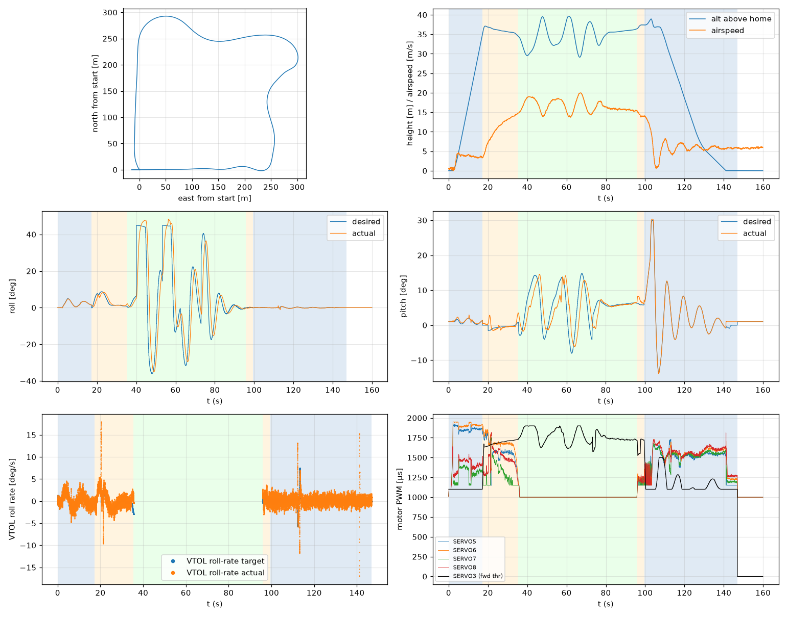

# Validation: indi_w6_s2

Log: `/home/trananhduy/quadplane-indi/rework/runs/noisy_wind/indi_w6_s2/flight.BIN`  
Mission completed (landed + disarmed): **True**

## Parameters read back from the log

| param | value |
|---|---|
| Q_ENABLE | 1.0 |
| Q_OPTIONS | 0.0 |
| Q_ASSIST_SPEED | 13.0 |
| AHRS_EKF_TYPE | 10.0 |
| SIM_WIND_SPD | 0.0 |
| AIRSPEED_CRUISE | 17.0 |
| AIRSPEED_MIN | 14.0 |
| AIRSPEED_STALL | 12.0 |
| Q_A_RAT_RLL_P | 0.699999988079071 |
| Q_A_RAT_RLL_I | 0.699999988079071 |
| Q_A_RAT_RLL_D | 0.029999999329447746 |
| Q_A_RAT_RLL_FF | 0.0 |
| Q_A_RAT_PIT_P | 0.30000001192092896 |
| Q_A_RAT_PIT_I | 0.30000001192092896 |
| Q_A_RAT_PIT_D | 0.02500000037252903 |
| Q_A_RAT_PIT_FF | 0.0 |
| Q_A_RAT_YAW_P | 4.0 |
| Q_A_RAT_YAW_I | 0.4000000059604645 |
| Q_A_RAT_YAW_D | 0.10000000149011612 |
| Q_A_ANG_RLL_P | 4.5 |
| Q_A_ANG_PIT_P | 4.5 |
| Q_A_ANG_YAW_P | 1.520650029182434 |
| RLL_RATE_P | 0.14106599986553192 |
| RLL_RATE_I | 0.17587700486183167 |
| RLL_RATE_D | 0.0015910000074654818 |
| RLL_RATE_FF | 0.17587700486183167 |
| PTCH_RATE_P | 0.2803190052509308 |
| PTCH_RATE_I | 0.8886290192604065 |
| PTCH_RATE_D | 0.004360999912023544 |
| PTCH_RATE_FF | 0.8886290192604065 |
| Q_M_PWM_MIN | 1000.0 |
| Q_M_PWM_MAX | 2000.0 |
| Q_M_SPIN_MIN | 0.15000000596046448 |
| Q_M_THST_HOVER | 0.3047795593738556 |
| Q_INDI_ENABLE | 1.0 |
| Q_INDI_AXES | 27.0 |
| Q_INDI_FILT_HZ | 12.699999809265137 |
| Q_INDI_RLL_K | 13.5 |
| Q_INDI_PIT_K | 13.5 |
| Q_INDI_RLL_G | 56.70000076293945 |
| Q_INDI_PIT_G | 44.79999923706055 |
| Q_INDI_ACT_TC | 0.0 |
| Q_INDI_ACT_DLY | 0.004000000189989805 |
| Q_INDI_FW_RLL_G | 16.700000762939453 |
| Q_INDI_FW_PIT_G | 12.399999618530273 |
| Q_INDI_FW_TC | 0.009999999776482582 |
| Q_INDI_FW_RLL_K | 10.5 |
| Q_INDI_FW_PIT_K | 10.5 |

## Events (s from log start)

- arm: -0.0
- transition_start: 17.2
- transition_done: 35.5
- back_transition: 95.8
- position2: 99.5
- land_complete: 146.9
- disarm: 146.9

## Phases

| phase | start | end | dur (s) | INDI on motors (% time) | INDI on surfaces (% time) |
|---|---|---|---|---|---|
| hover_takeoff | -0.0 | 17.2 | 17.2 | 92.5 | 0.0 |
| transition | 17.2 | 35.5 | 18.3 | 100.0 | 0.0 |
| fixed_wing | 35.5 | 95.8 | 60.3 | - | 100.0 |
| back_transition | 95.8 | 99.5 | 3.7 | 92.8 | 0.1 |
| hover_land | 99.5 | 146.9 | 47.4 | 100.0 | 0.0 |

## Attitude tracking (desired - actual, deg)

| phase | roll RMS | roll max | pitch RMS | pitch max | yaw RMS | yaw max |
|---|---|---|---|---|---|---|
| hover_takeoff | 0.13 | 0.38 | 0.30 | 1.03 | 5.10 | 28.80 |
| transition | 1.39 | 3.60 | 1.10 | 4.32 | - | - |
| fixed_wing | 13.16 | 44.44 | 4.25 | 10.27 | - | - |
| back_transition | 0.22 | 0.49 | 1.29 | 2.18 | - | - |
| hover_land | 0.13 | 1.36 | 0.49 | 1.90 | 0.26 | 2.01 |

## VTOL rate loop (PIQx target - actual, deg/s)

| phase | roll RMS | pitch RMS | yaw RMS | roll peak Hz | roll >5 Hz share / RMS (deg/s) | pitch peak Hz | pitch >5 Hz share / RMS (deg/s) |
|---|---|---|---|---|---|---|---|
| hover_takeoff | 0.87 | 1.37 | 12.52 | 0.15 | 0.27 / 0.730 | 0.22 | 0.18 / 0.546 |
| transition | 1.73 | 1.73 | 11.02 | 0.05 | 0.18 / 0.745 | 0.14 | 0.06 / 0.273 |
| back_transition | 1.20 | 2.46 | 0.81 | 0.90 | 0.24 / 0.600 | 0.23 | 0.01 / 0.160 |
| hover_land | 1.39 | 2.89 | 0.89 | 0.11 | 0.41 / 0.837 | 0.11 | 0.02 / 1.055 |

## VTOL height and motors

| phase | alt err RMS (m) | alt err max (m) | climb err RMS (m/s) | motor mean (0-1) | motor max | % any motor at max | % any motor at min |
|---|---|---|---|---|---|---|---|
| hover_takeoff | 0.07 | 0.46 | 0.29 | [0.778, 0.825, 0.287, 0.381] | [0.921, 0.95, 0.621, 0.639] | 0.0 | 18.84 |
| transition | 0.21 | 1.02 | 0.16 | [0.567, 0.659, 0.282, 0.476] | [0.852, 0.901, 0.76, 0.817] | 0.0 | 39.96 |
| back_transition | 0.37 | 0.48 | 0.48 | [0.175, 0.205, 0.178, 0.214] | [0.247, 0.297, 0.25, 0.284] | 0.0 | 100.0 |
| hover_land | 0.67 | 2.50 | 0.86 | [0.469, 0.509, 0.477, 0.52] | [0.732, 0.73, 0.677, 0.812] | 0.0 | 19.85 |

## Fixed-wing

### transition

- airspeed min/mean/max: 3.4 / 10.9 / 14.8 m/s; TECS speed-demand tracking RMS 6.98 m/s
- nav roll/pitch tracking RMS (CTUN): 1.38 / 1.09 deg (max 3.57 / 4.31)
- FW rate loop (PIDR/PIDP) RMS: 1.71 / 1.73 deg/s
- TECS height error RMS / max: 1.16 / 2.11 m
- cross-track RMS / max: 0.00 / 0.00 m
- throttle mean/max: 72.2 / 79.1 % (0.0 % of samples at max)
- VTOL assist active: 100.0 % of time; lift motors above idle: 100.0 % of samples

### fixed_wing

- airspeed min/mean/max: 13.7 / 16.6 / 20.0 m/s; TECS speed-demand tracking RMS 1.56 m/s
- nav roll/pitch tracking RMS (CTUN): 13.09 / 4.23 deg (max 43.76 / 10.18)
- FW rate loop (PIDR/PIDP) RMS: 2.11 / 1.30 deg/s
- TECS height error RMS / max: 2.90 / 5.88 m
- cross-track RMS / max: 17.41 / 52.26 m
- throttle mean/max: 83.5 / 100.0 % (11.8 % of samples at max)
- VTOL assist active: 0.0 % of time; lift motors above idle: 0.93 % of samples

## Mode changes

- 0.0 s: QHOVER
- 1.2 s: AUTO

## Autopilot messages

- -0.0 s: Throttle armed
- 0.0 s: ArduPlane V4.8.0-dev (7fa89979)
- 0.0 s: 158c274630044e33ab0c21188889c480
- 0.0 s: Param space used: 77/3840
- 0.0 s: RC Protocol: UDP
- 0.0 s: New mission
- 0.0 s: New rally
- 0.0 s: New fence
- 0.0 s: QuadPlane Frame: QUAD/X
- 0.0 s: GPS 1: probing for u-blox at 230400 baud
- 1.2 s: Mission: 1 Takeoff
- 3.2 s: Weathervane Active: nose in
- 17.2 s: Mission: 2 WP
- 17.2 s: Transition started airspeed 3.5
- 32.5 s: Transition airspeed reached 14.0
- 35.5 s: Transition done
- 39.9 s: Reached waypoint #2 dist 24m
- 39.9 s: Mission: 3 CondYaw
- 39.9 s: Mission: 4 WP
- 39.9 s: Skipping invalid cmd #115
- 53.2 s: Reached waypoint #4 dist 23m
- 53.2 s: Mission: 5 WP
- 73.0 s: Reached waypoint #5 dist 26m
- 73.0 s: Mission: 6 Land
- 73.0 s: VTOL approach d=255.3
- 95.8 s: VTOL airbrake v=9.3 d=40 sd=40 h=36.4
- 99.5 s: VTOL position1 v=8.0 d=9.0 h=37.4 dc=6.0
- 99.5 s: VTOL position2 started v=8.0 d=9.0 h=37.4
- 105.3 s: Weathervane Active: nose in
- 107.1 s: Land descend started
- 131.1 s: Land final started
- 146.9 s: Land complete
- 146.9 s: Throttle disarmed
- 147.5 s: PreArm: In landing sequence
- 147.5 s: PreArm: Auto missing takeoff waypoint

