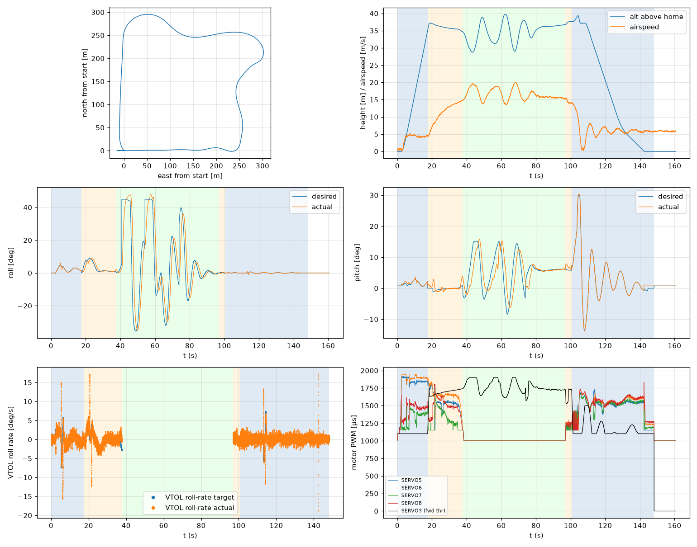

# Validation: indi_w6_s3

Log: `/home/trananhduy/quadplane-indi/rework/runs/noisy_wind/indi_w6_s3/flight.BIN`  
Mission completed (landed + disarmed): **True**

## Parameters read back from the log

| param | value |
|---|---|
| Q_ENABLE | 1.0 |
| Q_OPTIONS | 0.0 |
| Q_ASSIST_SPEED | 13.0 |
| AHRS_EKF_TYPE | 10.0 |
| SIM_WIND_SPD | 0.0 |
| AIRSPEED_CRUISE | 17.0 |
| AIRSPEED_MIN | 14.0 |
| AIRSPEED_STALL | 12.0 |
| Q_A_RAT_RLL_P | 0.699999988079071 |
| Q_A_RAT_RLL_I | 0.699999988079071 |
| Q_A_RAT_RLL_D | 0.029999999329447746 |
| Q_A_RAT_RLL_FF | 0.0 |
| Q_A_RAT_PIT_P | 0.30000001192092896 |
| Q_A_RAT_PIT_I | 0.30000001192092896 |
| Q_A_RAT_PIT_D | 0.02500000037252903 |
| Q_A_RAT_PIT_FF | 0.0 |
| Q_A_RAT_YAW_P | 4.0 |
| Q_A_RAT_YAW_I | 0.4000000059604645 |
| Q_A_RAT_YAW_D | 0.10000000149011612 |
| Q_A_ANG_RLL_P | 4.5 |
| Q_A_ANG_PIT_P | 4.5 |
| Q_A_ANG_YAW_P | 1.520650029182434 |
| RLL_RATE_P | 0.14106599986553192 |
| RLL_RATE_I | 0.17587700486183167 |
| RLL_RATE_D | 0.0015910000074654818 |
| RLL_RATE_FF | 0.17587700486183167 |
| PTCH_RATE_P | 0.2803190052509308 |
| PTCH_RATE_I | 0.8886290192604065 |
| PTCH_RATE_D | 0.004360999912023544 |
| PTCH_RATE_FF | 0.8886290192604065 |
| Q_M_PWM_MIN | 1000.0 |
| Q_M_PWM_MAX | 2000.0 |
| Q_M_SPIN_MIN | 0.15000000596046448 |
| Q_M_THST_HOVER | 0.3037032186985016 |
| Q_INDI_ENABLE | 1.0 |
| Q_INDI_AXES | 27.0 |
| Q_INDI_FILT_HZ | 12.699999809265137 |
| Q_INDI_RLL_K | 13.5 |
| Q_INDI_PIT_K | 13.5 |
| Q_INDI_RLL_G | 56.70000076293945 |
| Q_INDI_PIT_G | 44.79999923706055 |
| Q_INDI_ACT_TC | 0.0 |
| Q_INDI_ACT_DLY | 0.004000000189989805 |
| Q_INDI_FW_RLL_G | 16.700000762939453 |
| Q_INDI_FW_PIT_G | 12.399999618530273 |
| Q_INDI_FW_TC | 0.009999999776482582 |
| Q_INDI_FW_RLL_K | 10.5 |
| Q_INDI_FW_PIT_K | 10.5 |

## Events (s from log start)

- arm: -0.0
- transition_start: 17.5
- transition_done: 37.7
- back_transition: 96.9
- position2: 100.6
- land_complete: 148.2
- disarm: 148.2

## Phases

| phase | start | end | dur (s) | INDI on motors (% time) | INDI on surfaces (% time) |
|---|---|---|---|---|---|
| hover_takeoff | -0.0 | 17.5 | 17.5 | 93.0 | 0.0 |
| transition | 17.5 | 37.7 | 20.2 | 100.0 | 0.0 |
| fixed_wing | 37.7 | 96.9 | 59.2 | - | 100.0 |
| back_transition | 96.9 | 100.6 | 3.7 | 92.9 | 0.1 |
| hover_land | 100.6 | 148.2 | 47.6 | 100.0 | 0.0 |

## Attitude tracking (desired - actual, deg)

| phase | roll RMS | roll max | pitch RMS | pitch max | yaw RMS | yaw max |
|---|---|---|---|---|---|---|
| hover_takeoff | 0.27 | 1.54 | 0.32 | 1.05 | 5.40 | 35.71 |
| transition | 1.40 | 3.68 | 1.03 | 3.97 | - | - |
| fixed_wing | 13.36 | 45.53 | 4.50 | 11.05 | - | - |
| back_transition | 0.25 | 0.43 | 1.07 | 1.79 | - | - |
| hover_land | 0.13 | 1.34 | 0.48 | 1.85 | 0.25 | 1.93 |

## VTOL rate loop (PIQx target - actual, deg/s)

| phase | roll RMS | pitch RMS | yaw RMS | roll peak Hz | roll >5 Hz share / RMS (deg/s) | pitch peak Hz | pitch >5 Hz share / RMS (deg/s) |
|---|---|---|---|---|---|---|---|
| hover_takeoff | 2.06 | 1.34 | 13.42 | 0.14 | 0.16 / 0.917 | 0.21 | 0.17 / 0.545 |
| transition | 1.68 | 1.71 | 9.57 | 0.08 | 0.16 / 0.711 | 0.08 | 0.05 / 0.255 |
| back_transition | 0.88 | 2.25 | 0.65 | 1.57 | 0.34 / 0.550 | 0.22 | 0.03 / 0.152 |
| hover_land | 1.39 | 2.82 | 0.85 | 0.11 | 0.41 / 0.821 | 0.11 | 0.02 / 0.954 |

## VTOL height and motors

| phase | alt err RMS (m) | alt err max (m) | climb err RMS (m/s) | motor mean (0-1) | motor max | % any motor at max | % any motor at min |
|---|---|---|---|---|---|---|---|
| hover_takeoff | 0.08 | 0.47 | 0.30 | [0.766, 0.81, 0.311, 0.415] | [0.921, 0.95, 0.623, 0.648] | 0.0 | 18.26 |
| transition | 0.16 | 0.74 | 0.12 | [0.544, 0.639, 0.301, 0.488] | [0.838, 0.882, 0.757, 0.808] | 0.0 | 31.68 |
| back_transition | 0.33 | 0.45 | 0.43 | [0.169, 0.211, 0.18, 0.224] | [0.239, 0.276, 0.244, 0.287] | 0.0 | 100.0 |
| hover_land | 0.69 | 2.50 | 0.89 | [0.469, 0.511, 0.474, 0.518] | [0.732, 0.732, 0.676, 0.834] | 0.0 | 20.02 |

## Fixed-wing

### transition

- airspeed min/mean/max: 4.3 / 11.2 / 14.8 m/s; TECS speed-demand tracking RMS 6.57 m/s
- nav roll/pitch tracking RMS (CTUN): 1.39 / 1.02 deg (max 3.63 / 3.96)
- FW rate loop (PIDR/PIDP) RMS: 1.63 / 1.71 deg/s
- TECS height error RMS / max: 1.16 / 2.18 m
- cross-track RMS / max: 0.00 / 0.00 m
- throttle mean/max: 73.0 / 80.1 % (0.0 % of samples at max)
- VTOL assist active: 99.9 % of time; lift motors above idle: 100.0 % of samples

### fixed_wing

- airspeed min/mean/max: 13.4 / 16.5 / 20.0 m/s; TECS speed-demand tracking RMS 1.61 m/s
- nav roll/pitch tracking RMS (CTUN): 13.28 / 4.47 deg (max 44.89 / 10.84)
- FW rate loop (PIDR/PIDP) RMS: 2.11 / 1.30 deg/s
- TECS height error RMS / max: 2.93 / 6.26 m
- cross-track RMS / max: 18.07 / 52.79 m
- throttle mean/max: 83.5 / 100.0 % (15.3 % of samples at max)
- VTOL assist active: 0.0 % of time; lift motors above idle: 0.95 % of samples

## Mode changes

- 0.0 s: QHOVER
- 1.1 s: AUTO

## Autopilot messages

- -0.0 s: Throttle armed
- 0.0 s: ArduPlane V4.8.0-dev (7fa89979)
- 0.0 s: 158c274630044e33ab0c21188889c480
- 0.0 s: Param space used: 77/3840
- 0.0 s: RC Protocol: UDP
- 0.0 s: New mission
- 0.0 s: New rally
- 0.0 s: New fence
- 0.0 s: QuadPlane Frame: QUAD/X
- 0.0 s: GPS 1: probing for u-blox at 230400 baud
- 1.1 s: Mission: 1 Takeoff
- 3.1 s: Weathervane Active: nose in
- 17.5 s: Mission: 2 WP
- 17.5 s: Transition started airspeed 4.6
- 34.7 s: Transition airspeed reached 14.1
- 37.7 s: Transition done
- 40.7 s: Reached waypoint #2 dist 24m
- 40.7 s: Mission: 3 CondYaw
- 40.7 s: Mission: 4 WP
- 40.7 s: Skipping invalid cmd #115
- 54.1 s: Reached waypoint #4 dist 25m
- 54.1 s: Mission: 5 WP
- 73.9 s: Reached waypoint #5 dist 25m
- 73.9 s: Mission: 6 Land
- 73.9 s: VTOL approach d=255.6
- 96.9 s: VTOL airbrake v=9.4 d=41 sd=41 h=36.8
- 100.6 s: VTOL position1 v=8.1 d=9.5 h=37.7 dc=6.1
- 100.6 s: VTOL position2 started v=8.1 d=9.5 h=37.7
- 106.5 s: Weathervane Active: nose in
- 108.2 s: Land descend started
- 132.4 s: Land final started
- 148.2 s: Land complete
- 148.2 s: Throttle disarmed

