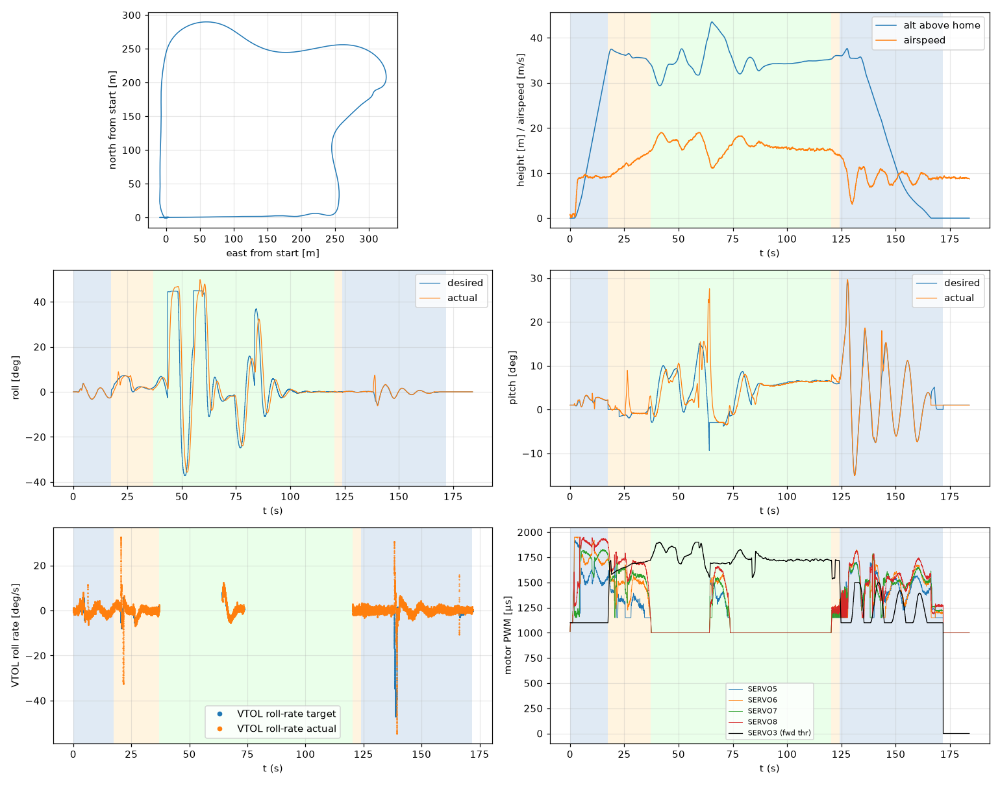

# Validation: indi_w9_s2

Log: `/home/trananhduy/quadplane-indi/rework/runs/noisy_wind/indi_w9_s2/flight.BIN`  
Mission completed (landed + disarmed): **True**

## Parameters read back from the log

| param | value |
|---|---|
| Q_ENABLE | 1.0 |
| Q_OPTIONS | 0.0 |
| Q_ASSIST_SPEED | 13.0 |
| AHRS_EKF_TYPE | 10.0 |
| SIM_WIND_SPD | 0.0 |
| AIRSPEED_CRUISE | 17.0 |
| AIRSPEED_MIN | 14.0 |
| AIRSPEED_STALL | 12.0 |
| Q_A_RAT_RLL_P | 0.699999988079071 |
| Q_A_RAT_RLL_I | 0.699999988079071 |
| Q_A_RAT_RLL_D | 0.029999999329447746 |
| Q_A_RAT_RLL_FF | 0.0 |
| Q_A_RAT_PIT_P | 0.30000001192092896 |
| Q_A_RAT_PIT_I | 0.30000001192092896 |
| Q_A_RAT_PIT_D | 0.02500000037252903 |
| Q_A_RAT_PIT_FF | 0.0 |
| Q_A_RAT_YAW_P | 4.0 |
| Q_A_RAT_YAW_I | 0.4000000059604645 |
| Q_A_RAT_YAW_D | 0.10000000149011612 |
| Q_A_ANG_RLL_P | 4.5 |
| Q_A_ANG_PIT_P | 4.5 |
| Q_A_ANG_YAW_P | 1.520650029182434 |
| RLL_RATE_P | 0.14106599986553192 |
| RLL_RATE_I | 0.17587700486183167 |
| RLL_RATE_D | 0.0015910000074654818 |
| RLL_RATE_FF | 0.17587700486183167 |
| PTCH_RATE_P | 0.2803190052509308 |
| PTCH_RATE_I | 0.8886290192604065 |
| PTCH_RATE_D | 0.004360999912023544 |
| PTCH_RATE_FF | 0.8886290192604065 |
| Q_M_PWM_MIN | 1000.0 |
| Q_M_PWM_MAX | 2000.0 |
| Q_M_SPIN_MIN | 0.15000000596046448 |
| Q_M_THST_HOVER | 0.30507323145866394 |
| Q_INDI_ENABLE | 1.0 |
| Q_INDI_AXES | 27.0 |
| Q_INDI_FILT_HZ | 12.699999809265137 |
| Q_INDI_RLL_K | 13.5 |
| Q_INDI_PIT_K | 13.5 |
| Q_INDI_RLL_G | 56.70000076293945 |
| Q_INDI_PIT_G | 44.79999923706055 |
| Q_INDI_ACT_TC | 0.0 |
| Q_INDI_ACT_DLY | 0.004000000189989805 |
| Q_INDI_FW_RLL_G | 16.700000762939453 |
| Q_INDI_FW_PIT_G | 12.399999618530273 |
| Q_INDI_FW_TC | 0.009999999776482582 |
| Q_INDI_FW_RLL_K | 10.5 |
| Q_INDI_FW_PIT_K | 10.5 |

## Events (s from log start)

- arm: -0.0
- transition_start: 17.5
- transition_done: 37.0
- back_transition: 120.3
- position2: 124.0
- land_complete: 171.9
- disarm: 171.9

## Phases

| phase | start | end | dur (s) | INDI on motors (% time) | INDI on surfaces (% time) |
|---|---|---|---|---|---|
| hover_takeoff | -0.0 | 17.5 | 17.5 | 92.7 | 0.0 |
| transition | 17.5 | 37.0 | 19.5 | 100.0 | 0.0 |
| fixed_wing | 37.0 | 120.3 | 83.3 | 10.7 | 88.9 |
| back_transition | 120.3 | 124.0 | 3.8 | 93.0 | 0.1 |
| hover_land | 124.0 | 171.9 | 47.8 | 100.0 | 0.0 |

## Attitude tracking (desired - actual, deg)

| phase | roll RMS | roll max | pitch RMS | pitch max | yaw RMS | yaw max |
|---|---|---|---|---|---|---|
| hover_takeoff | 0.14 | 0.53 | 0.32 | 1.72 | 3.89 | 93.65 |
| transition | 1.61 | 4.90 | 2.07 | 10.50 | - | - |
| fixed_wing | 10.48 | 43.87 | 4.23 | 36.33 | - | - |
| back_transition | 0.13 | 0.37 | 1.01 | 1.70 | - | - |
| hover_land | 1.13 | 9.85 | 1.25 | 10.16 | 1.23 | 9.44 |

## VTOL rate loop (PIQx target - actual, deg/s)

| phase | roll RMS | pitch RMS | yaw RMS | roll peak Hz | roll >5 Hz share / RMS (deg/s) | pitch peak Hz | pitch >5 Hz share / RMS (deg/s) |
|---|---|---|---|---|---|---|---|
| hover_takeoff | 1.13 | 2.45 | 22.18 | 0.11 | 0.22 / 0.862 | 1.37 | 0.10 / 0.714 |
| transition | 3.73 | 4.43 | 1.88 | 0.13 | 0.08 / 0.932 | 0.26 | 0.02 / 0.504 |
| back_transition | 0.95 | 2.10 | 0.67 | 1.55 | 0.47 / 0.626 | 0.22 | 0.03 / 0.155 |
| hover_land | 5.97 | 7.02 | 3.68 | 0.12 | 0.05 / 0.875 | 0.09 | 0.00 / 0.813 |

## VTOL height and motors

| phase | alt err RMS (m) | alt err max (m) | climb err RMS (m/s) | motor mean (0-1) | motor max | % any motor at max | % any motor at min |
|---|---|---|---|---|---|---|---|
| hover_takeoff | 0.08 | 0.40 | 0.32 | [0.549, 0.704, 0.627, 0.751] | [0.917, 0.95, 0.868, 0.95] | 0.0 | 9.38 |
| transition | 0.29 | 1.27 | 0.30 | [0.297, 0.468, 0.537, 0.663] | [0.72, 0.769, 0.757, 0.878] | 0.0 | 30.94 |
| back_transition | 0.40 | 0.53 | 0.51 | [0.165, 0.206, 0.18, 0.222] | [0.243, 0.263, 0.251, 0.275] | 0.0 | 100.0 |
| hover_land | 0.67 | 2.50 | 0.86 | [0.411, 0.442, 0.455, 0.492] | [0.712, 0.824, 0.785, 0.819] | 0.0 | 28.76 |

## Fixed-wing

### transition

- airspeed min/mean/max: 9.1 / 12.0 / 15.0 m/s; TECS speed-demand tracking RMS 5.28 m/s
- nav roll/pitch tracking RMS (CTUN): 1.60 / 2.07 deg (max 4.82 / 10.49)
- FW rate loop (PIDR/PIDP) RMS: 3.72 / 4.43 deg/s
- TECS height error RMS / max: 1.23 / 2.36 m
- cross-track RMS / max: 0.00 / 0.00 m
- throttle mean/max: 69.7 / 77.5 % (0.0 % of samples at max)
- VTOL assist active: 100.0 % of time; lift motors above idle: 100.0 % of samples

### fixed_wing

- airspeed min/mean/max: 11.1 / 16.0 / 19.0 m/s; TECS speed-demand tracking RMS 1.67 m/s
- nav roll/pitch tracking RMS (CTUN): 10.40 / 4.23 deg (max 43.27 / 34.78)
- FW rate loop (PIDR/PIDP) RMS: 2.47 / 5.21 deg/s
- TECS height error RMS / max: 2.87 / 8.53 m
- cross-track RMS / max: 25.67 / 76.33 m
- throttle mean/max: 81.0 / 100.0 % (3.6 % of samples at max)
- VTOL assist active: 11.1 % of time; lift motors above idle: 11.91 % of samples

## Mode changes

- 0.0 s: QHOVER
- 1.2 s: AUTO

## Autopilot messages

- -0.0 s: Throttle armed
- 0.0 s: ArduPlane V4.8.0-dev (7fa89979)
- 0.0 s: 158c274630044e33ab0c21188889c480
- 0.0 s: Param space used: 77/3840
- 0.0 s: RC Protocol: UDP
- 0.0 s: New mission
- 0.0 s: New rally
- 0.0 s: New fence
- 0.0 s: QuadPlane Frame: QUAD/X
- 0.0 s: GPS 1: probing for u-blox at 230400 baud
- 1.2 s: Mission: 1 Takeoff
- 3.2 s: Weathervane Active: nose in
- 17.5 s: Mission: 2 WP
- 17.5 s: Transition started airspeed 9.2
- 34.0 s: Transition airspeed reached 14.0
- 37.0 s: Transition done
- 43.4 s: Reached waypoint #2 dist 25m
- 43.4 s: Mission: 3 CondYaw
- 43.4 s: Mission: 4 WP
- 43.4 s: Skipping invalid cmd #115
- 55.3 s: Reached waypoint #4 dist 24m
- 55.3 s: Mission: 5 WP
- 64.2 s: Transition started airspeed 12.8
- 70.4 s: Transition airspeed reached 14.0
- 73.4 s: Transition done
- 83.6 s: Reached waypoint #5 dist 26m
- 83.6 s: Mission: 6 Land
- 83.6 s: VTOL approach d=257.6
- 120.3 s: VTOL airbrake v=6.2 d=22 sd=22 h=35.3
- 124.0 s: VTOL position1 v=5.0 d=2.6 h=36.0 dc=3.0
- 124.0 s: VTOL position2 started v=5.0 d=2.6 h=36.0
- 129.9 s: Weathervane Active: nose in
- 133.3 s: Land descend started
- 156.3 s: Land final started
- 171.9 s: Land complete
- 171.9 s: Throttle disarmed
- 178.0 s: PreArm: In landing sequence
- 178.0 s: PreArm: Auto missing takeoff waypoint

