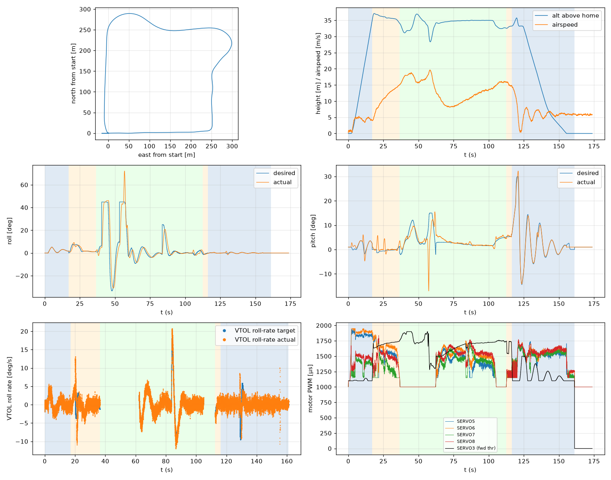

# Validation: pid_w6_s1

Log: `/home/trananhduy/quadplane-indi/rework/runs/noisy_wind/pid_w6_s1/flight.BIN`  
Mission completed (landed + disarmed): **True**

## Parameters read back from the log

| param | value |
|---|---|
| Q_ENABLE | 1.0 |
| Q_OPTIONS | 0.0 |
| Q_ASSIST_SPEED | 13.0 |
| AHRS_EKF_TYPE | 10.0 |
| SIM_WIND_SPD | 0.0 |
| AIRSPEED_CRUISE | 17.0 |
| AIRSPEED_MIN | 14.0 |
| AIRSPEED_STALL | 12.0 |
| Q_A_RAT_RLL_P | 0.699999988079071 |
| Q_A_RAT_RLL_I | 0.699999988079071 |
| Q_A_RAT_RLL_D | 0.029999999329447746 |
| Q_A_RAT_RLL_FF | 0.0 |
| Q_A_RAT_PIT_P | 0.30000001192092896 |
| Q_A_RAT_PIT_I | 0.30000001192092896 |
| Q_A_RAT_PIT_D | 0.02500000037252903 |
| Q_A_RAT_PIT_FF | 0.0 |
| Q_A_RAT_YAW_P | 4.0 |
| Q_A_RAT_YAW_I | 0.4000000059604645 |
| Q_A_RAT_YAW_D | 0.10000000149011612 |
| Q_A_ANG_RLL_P | 4.5 |
| Q_A_ANG_PIT_P | 4.5 |
| Q_A_ANG_YAW_P | 1.520650029182434 |
| RLL_RATE_P | 0.14106599986553192 |
| RLL_RATE_I | 0.17587700486183167 |
| RLL_RATE_D | 0.0015910000074654818 |
| RLL_RATE_FF | 0.17587700486183167 |
| PTCH_RATE_P | 0.2803190052509308 |
| PTCH_RATE_I | 0.8886290192604065 |
| PTCH_RATE_D | 0.004360999912023544 |
| PTCH_RATE_FF | 0.8886290192604065 |
| Q_M_PWM_MIN | 1000.0 |
| Q_M_PWM_MAX | 2000.0 |
| Q_M_SPIN_MIN | 0.15000000596046448 |
| Q_M_THST_HOVER | 0.3029671311378479 |
| Q_INDI_ENABLE | 0.0 |
| Q_INDI_AXES | None |
| Q_INDI_FILT_HZ | None |
| Q_INDI_RLL_K | None |
| Q_INDI_PIT_K | None |
| Q_INDI_RLL_G | None |
| Q_INDI_PIT_G | None |
| Q_INDI_ACT_TC | None |
| Q_INDI_ACT_DLY | None |
| Q_INDI_FW_RLL_G | None |
| Q_INDI_FW_PIT_G | None |
| Q_INDI_FW_TC | None |
| Q_INDI_FW_RLL_K | None |
| Q_INDI_FW_PIT_K | None |

## Events (s from log start)

- arm: -0.0
- transition_start: 17.0
- transition_done: 36.4
- back_transition: 112.5
- position2: 116.3
- land_complete: 161.1
- disarm: 161.1

## Phases

| phase | start | end | dur (s) | INDI on motors (% time) | INDI on surfaces (% time) |
|---|---|---|---|---|---|
| hover_takeoff | -0.0 | 17.0 | 17.0 | - | - |
| transition | 17.0 | 36.4 | 19.4 | - | - |
| fixed_wing | 36.4 | 112.5 | 76.1 | - | - |
| back_transition | 112.5 | 116.3 | 3.8 | - | - |
| hover_land | 116.3 | 161.1 | 44.8 | - | - |

## Attitude tracking (desired - actual, deg)

| phase | roll RMS | roll max | pitch RMS | pitch max | yaw RMS | yaw max |
|---|---|---|---|---|---|---|
| hover_takeoff | 0.16 | 0.47 | 1.24 | 4.36 | 4.91 | 35.20 |
| transition | 1.32 | 3.55 | 1.80 | 7.10 | - | - |
| fixed_wing | 8.78 | 41.20 | 3.42 | 29.04 | - | - |
| back_transition | 0.76 | 2.17 | 0.38 | 0.73 | - | - |
| hover_land | 0.27 | 1.76 | 0.92 | 3.52 | 0.29 | 2.05 |

## VTOL rate loop (PIQx target - actual, deg/s)

| phase | roll RMS | pitch RMS | yaw RMS | roll peak Hz | roll >5 Hz share / RMS (deg/s) | pitch peak Hz | pitch >5 Hz share / RMS (deg/s) |
|---|---|---|---|---|---|---|---|
| hover_takeoff | 0.95 | 6.02 | 13.26 | 0.12 | 0.27 / 0.818 | 0.47 | 0.01 / 0.446 |
| transition | 2.52 | 3.30 | 10.29 | 0.04 | 0.25 / 0.908 | 0.34 | 0.00 / 0.219 |
| back_transition | 1.16 | 1.02 | 0.73 | 0.26 | 0.36 / 0.727 | 0.26 | 0.06 / 0.128 |
| hover_land | 1.80 | 4.57 | 0.91 | 0.11 | 0.55 / 0.968 | 0.09 | 0.01 / 0.530 |

## VTOL height and motors

| phase | alt err RMS (m) | alt err max (m) | climb err RMS (m/s) | motor mean (0-1) | motor max | % any motor at max | % any motor at min |
|---|---|---|---|---|---|---|---|
| hover_takeoff | 0.08 | 0.50 | 0.31 | [0.772, 0.82, 0.329, 0.42] | [0.939, 0.95, 0.64, 0.673] | 0.0 | 13.38 |
| transition | 0.25 | 1.26 | 0.20 | [0.547, 0.634, 0.296, 0.473] | [0.853, 0.89, 0.753, 0.838] | 0.0 | 31.96 |
| back_transition | 0.48 | 0.71 | 0.64 | [0.179, 0.187, 0.196, 0.205] | [0.271, 0.278, 0.266, 0.288] | 0.0 | 100.0 |
| hover_land | 0.82 | 2.50 | 1.05 | [0.469, 0.506, 0.475, 0.514] | [0.74, 0.764, 0.695, 0.773] | 0.0 | 20.09 |

## Fixed-wing

### transition

- airspeed min/mean/max: 3.9 / 10.8 / 15.0 m/s; TECS speed-demand tracking RMS 6.97 m/s
- nav roll/pitch tracking RMS (CTUN): 1.31 / 1.80 deg (max 3.49 / 7.07)
- FW rate loop (PIDR/PIDP) RMS: 2.39 / 3.32 deg/s
- TECS height error RMS / max: 1.14 / 2.11 m
- cross-track RMS / max: 0.00 / 0.00 m
- throttle mean/max: 73.5 / 80.5 % (0.0 % of samples at max)
- VTOL assist active: 99.9 % of time; lift motors above idle: 100.0 % of samples

### fixed_wing

- airspeed min/mean/max: 8.1 / 13.5 / 19.7 m/s; TECS speed-demand tracking RMS 4.60 m/s
- nav roll/pitch tracking RMS (CTUN): 8.72 / 3.41 deg (max 40.49 / 28.71)
- FW rate loop (PIDR/PIDP) RMS: 10.32 / 2.96 deg/s
- TECS height error RMS / max: 1.82 / 6.66 m
- cross-track RMS / max: 14.07 / 49.69 m
- throttle mean/max: 73.0 / 100.0 % (4.8 % of samples at max)
- VTOL assist active: 56.1 % of time; lift motors above idle: 57.1 % of samples

## Mode changes

- 0.0 s: QHOVER
- 1.2 s: AUTO

## Autopilot messages

- -0.0 s: Throttle armed
- 0.0 s: ArduPlane V4.8.0-dev (7fa89979)
- 0.0 s: 158c274630044e33ab0c21188889c480
- 0.0 s: Param space used: 77/3840
- 0.0 s: RC Protocol: UDP
- 0.0 s: New mission
- 0.0 s: New rally
- 0.0 s: New fence
- 0.0 s: QuadPlane Frame: QUAD/X
- 0.0 s: GPS 1: probing for u-blox at 230400 baud
- 1.2 s: Mission: 1 Takeoff
- 3.2 s: Weathervane Active: nose in
- 17.0 s: Mission: 2 WP
- 17.0 s: Transition started airspeed 4.0
- 33.4 s: Transition airspeed reached 14.0
- 36.4 s: Transition done
- 40.4 s: Reached waypoint #2 dist 25m
- 40.4 s: Mission: 3 CondYaw
- 40.4 s: Mission: 4 WP
- 40.4 s: Skipping invalid cmd #115
- 53.1 s: Reached waypoint #4 dist 25m
- 53.1 s: Mission: 5 WP
- 62.2 s: Transition started airspeed 13.0
- 83.6 s: Reached waypoint #5 dist 24m
- 83.6 s: Mission: 6 Land
- 83.6 s: VTOL approach d=253.5
- 101.9 s: Transition airspeed reached 14.0
- 104.9 s: Transition done
- 112.5 s: VTOL airbrake v=10.0 d=44 sd=45 h=32.6
- 116.1 s: VTOL position1 v=8.8 d=11.4 h=33.2 dc=6.7
- 116.3 s: VTOL position2 started v=8.7 d=9.7 h=33.2
- 122.2 s: Weathervane Active: nose in
- 123.8 s: Land descend started
- 145.5 s: Land final started
- 161.1 s: Land complete
- 161.1 s: Throttle disarmed

