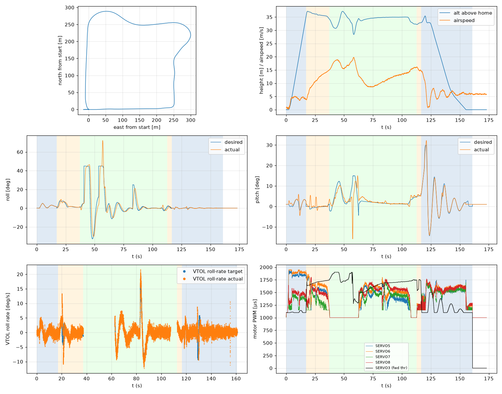

# Validation: pid_w6_s2

Log: `/home/trananhduy/quadplane-indi/rework/runs/noisy_wind/pid_w6_s2/flight.BIN`  
Mission completed (landed + disarmed): **True**

## Parameters read back from the log

| param | value |
|---|---|
| Q_ENABLE | 1.0 |
| Q_OPTIONS | 0.0 |
| Q_ASSIST_SPEED | 13.0 |
| AHRS_EKF_TYPE | 10.0 |
| SIM_WIND_SPD | 0.0 |
| AIRSPEED_CRUISE | 17.0 |
| AIRSPEED_MIN | 14.0 |
| AIRSPEED_STALL | 12.0 |
| Q_A_RAT_RLL_P | 0.699999988079071 |
| Q_A_RAT_RLL_I | 0.699999988079071 |
| Q_A_RAT_RLL_D | 0.029999999329447746 |
| Q_A_RAT_RLL_FF | 0.0 |
| Q_A_RAT_PIT_P | 0.30000001192092896 |
| Q_A_RAT_PIT_I | 0.30000001192092896 |
| Q_A_RAT_PIT_D | 0.02500000037252903 |
| Q_A_RAT_PIT_FF | 0.0 |
| Q_A_RAT_YAW_P | 4.0 |
| Q_A_RAT_YAW_I | 0.4000000059604645 |
| Q_A_RAT_YAW_D | 0.10000000149011612 |
| Q_A_ANG_RLL_P | 4.5 |
| Q_A_ANG_PIT_P | 4.5 |
| Q_A_ANG_YAW_P | 1.520650029182434 |
| RLL_RATE_P | 0.14106599986553192 |
| RLL_RATE_I | 0.17587700486183167 |
| RLL_RATE_D | 0.0015910000074654818 |
| RLL_RATE_FF | 0.17587700486183167 |
| PTCH_RATE_P | 0.2803190052509308 |
| PTCH_RATE_I | 0.8886290192604065 |
| PTCH_RATE_D | 0.004360999912023544 |
| PTCH_RATE_FF | 0.8886290192604065 |
| Q_M_PWM_MIN | 1000.0 |
| Q_M_PWM_MAX | 2000.0 |
| Q_M_SPIN_MIN | 0.15000000596046448 |
| Q_M_THST_HOVER | 0.30328312516212463 |
| Q_INDI_ENABLE | 0.0 |
| Q_INDI_AXES | None |
| Q_INDI_FILT_HZ | None |
| Q_INDI_RLL_K | None |
| Q_INDI_PIT_K | None |
| Q_INDI_RLL_G | None |
| Q_INDI_PIT_G | None |
| Q_INDI_ACT_TC | None |
| Q_INDI_ACT_DLY | None |
| Q_INDI_FW_RLL_G | None |
| Q_INDI_FW_PIT_G | None |
| Q_INDI_FW_TC | None |
| Q_INDI_FW_RLL_K | None |
| Q_INDI_FW_PIT_K | None |

## Events (s from log start)

- arm: -0.0
- transition_start: 17.1
- transition_done: 37.2
- back_transition: 112.7
- position2: 116.5
- land_complete: 160.9
- disarm: 160.9

## Phases

| phase | start | end | dur (s) | INDI on motors (% time) | INDI on surfaces (% time) |
|---|---|---|---|---|---|
| hover_takeoff | -0.0 | 17.1 | 17.1 | - | - |
| transition | 17.1 | 37.2 | 20.1 | - | - |
| fixed_wing | 37.2 | 112.7 | 75.5 | - | - |
| back_transition | 112.7 | 116.5 | 3.8 | - | - |
| hover_land | 116.5 | 160.9 | 44.4 | - | - |

## Attitude tracking (desired - actual, deg)

| phase | roll RMS | roll max | pitch RMS | pitch max | yaw RMS | yaw max |
|---|---|---|---|---|---|---|
| hover_takeoff | 0.15 | 0.37 | 1.22 | 4.37 | 4.99 | 34.14 |
| transition | 1.29 | 3.62 | 1.75 | 6.73 | - | - |
| fixed_wing | 8.89 | 41.57 | 3.50 | 30.22 | - | - |
| back_transition | 1.14 | 2.61 | 0.39 | 0.67 | - | - |
| hover_land | 0.27 | 1.67 | 0.94 | 3.50 | 0.27 | 1.96 |

## VTOL rate loop (PIQx target - actual, deg/s)

| phase | roll RMS | pitch RMS | yaw RMS | roll peak Hz | roll >5 Hz share / RMS (deg/s) | pitch peak Hz | pitch >5 Hz share / RMS (deg/s) |
|---|---|---|---|---|---|---|---|
| hover_takeoff | 0.98 | 5.92 | 13.19 | 0.12 | 0.30 / 0.870 | 0.47 | 0.01 / 0.459 |
| transition | 2.47 | 3.26 | 10.06 | 0.04 | 0.26 / 0.887 | 0.33 | 0.00 / 0.218 |
| back_transition | 0.95 | 1.20 | 0.93 | 0.26 | 0.34 / 0.735 | 0.26 | 0.05 / 0.135 |
| hover_land | 1.84 | 4.69 | 0.85 | 0.32 | 0.60 / 1.027 | 0.09 | 0.01 / 0.614 |

## VTOL height and motors

| phase | alt err RMS (m) | alt err max (m) | climb err RMS (m/s) | motor mean (0-1) | motor max | % any motor at max | % any motor at min |
|---|---|---|---|---|---|---|---|
| hover_takeoff | 0.07 | 0.45 | 0.29 | [0.773, 0.821, 0.323, 0.414] | [0.935, 0.95, 0.631, 0.646] | 0.0 | 16.12 |
| transition | 0.22 | 1.12 | 0.20 | [0.545, 0.63, 0.296, 0.477] | [0.851, 0.896, 0.732, 0.805] | 0.0 | 32.67 |
| back_transition | 0.48 | 0.71 | 0.63 | [0.188, 0.201, 0.192, 0.201] | [0.262, 0.286, 0.296, 0.318] | 0.0 | 100.0 |
| hover_land | 0.82 | 2.50 | 1.06 | [0.478, 0.514, 0.468, 0.509] | [0.748, 0.757, 0.694, 0.769] | 0.0 | 20.47 |

## Fixed-wing

### transition

- airspeed min/mean/max: 3.7 / 10.9 / 15.0 m/s; TECS speed-demand tracking RMS 6.88 m/s
- nav roll/pitch tracking RMS (CTUN): 1.28 / 1.75 deg (max 3.55 / 6.72)
- FW rate loop (PIDR/PIDP) RMS: 2.35 / 3.28 deg/s
- TECS height error RMS / max: 1.14 / 2.13 m
- cross-track RMS / max: 0.00 / 0.00 m
- throttle mean/max: 73.7 / 80.8 % (0.0 % of samples at max)
- VTOL assist active: 100.0 % of time; lift motors above idle: 100.0 % of samples

### fixed_wing

- airspeed min/mean/max: 8.5 / 13.6 / 19.8 m/s; TECS speed-demand tracking RMS 4.41 m/s
- nav roll/pitch tracking RMS (CTUN): 8.83 / 3.49 deg (max 41.53 / 29.60)
- FW rate loop (PIDR/PIDP) RMS: 10.35 / 3.10 deg/s
- TECS height error RMS / max: 1.85 / 6.61 m
- cross-track RMS / max: 14.30 / 50.86 m
- throttle mean/max: 72.0 / 100.0 % (5.8 % of samples at max)
- VTOL assist active: 59.5 % of time; lift motors above idle: 60.49 % of samples

## Mode changes

- 0.0 s: QHOVER
- 1.2 s: AUTO

## Autopilot messages

- -0.0 s: Throttle armed
- 0.0 s: ArduPlane V4.8.0-dev (7fa89979)
- 0.0 s: 158c274630044e33ab0c21188889c480
- 0.0 s: Param space used: 77/3840
- 0.0 s: RC Protocol: UDP
- 0.0 s: New mission
- 0.0 s: New rally
- 0.0 s: New fence
- 0.0 s: QuadPlane Frame: QUAD/X
- 0.0 s: GPS 1: probing for u-blox at 230400 baud
- 1.2 s: Mission: 1 Takeoff
- 3.2 s: Weathervane Active: nose in
- 17.1 s: Mission: 2 WP
- 17.1 s: Transition started airspeed 3.9
- 34.2 s: Transition airspeed reached 14.1
- 37.2 s: Transition done
- 40.6 s: Reached waypoint #2 dist 26m
- 40.6 s: Mission: 3 CondYaw
- 40.6 s: Mission: 4 WP
- 40.6 s: Skipping invalid cmd #115
- 53.3 s: Reached waypoint #4 dist 24m
- 53.3 s: Mission: 5 WP
- 62.5 s: Transition started airspeed 12.9
- 82.8 s: Reached waypoint #5 dist 24m
- 82.8 s: Mission: 6 Land
- 82.8 s: VTOL approach d=253.5
- 104.4 s: Transition airspeed reached 14.1
- 107.4 s: Transition done
- 112.7 s: VTOL airbrake v=10.0 d=44 sd=45 h=32.2
- 116.3 s: VTOL position1 v=8.8 d=12.4 h=32.9 dc=6.8
- 116.5 s: VTOL position2 started v=8.8 d=9.7 h=32.9
- 122.4 s: Weathervane Active: nose in
- 123.9 s: Land descend started
- 145.3 s: Land final started
- 160.9 s: Land complete
- 160.9 s: Throttle disarmed

