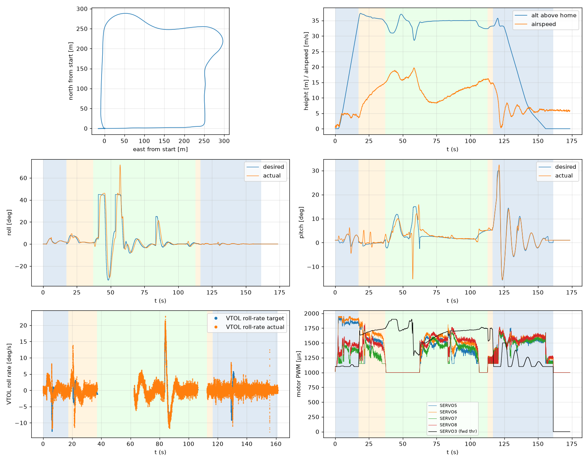

# Validation: pid_w6_s3

Log: `/home/trananhduy/quadplane-indi/rework/runs/noisy_wind/pid_w6_s3/flight.BIN`  
Mission completed (landed + disarmed): **True**

## Parameters read back from the log

| param | value |
|---|---|
| Q_ENABLE | 1.0 |
| Q_OPTIONS | 0.0 |
| Q_ASSIST_SPEED | 13.0 |
| AHRS_EKF_TYPE | 10.0 |
| SIM_WIND_SPD | 0.0 |
| AIRSPEED_CRUISE | 17.0 |
| AIRSPEED_MIN | 14.0 |
| AIRSPEED_STALL | 12.0 |
| Q_A_RAT_RLL_P | 0.699999988079071 |
| Q_A_RAT_RLL_I | 0.699999988079071 |
| Q_A_RAT_RLL_D | 0.029999999329447746 |
| Q_A_RAT_RLL_FF | 0.0 |
| Q_A_RAT_PIT_P | 0.30000001192092896 |
| Q_A_RAT_PIT_I | 0.30000001192092896 |
| Q_A_RAT_PIT_D | 0.02500000037252903 |
| Q_A_RAT_PIT_FF | 0.0 |
| Q_A_RAT_YAW_P | 4.0 |
| Q_A_RAT_YAW_I | 0.4000000059604645 |
| Q_A_RAT_YAW_D | 0.10000000149011612 |
| Q_A_ANG_RLL_P | 4.5 |
| Q_A_ANG_PIT_P | 4.5 |
| Q_A_ANG_YAW_P | 1.520650029182434 |
| RLL_RATE_P | 0.14106599986553192 |
| RLL_RATE_I | 0.17587700486183167 |
| RLL_RATE_D | 0.0015910000074654818 |
| RLL_RATE_FF | 0.17587700486183167 |
| PTCH_RATE_P | 0.2803190052509308 |
| PTCH_RATE_I | 0.8886290192604065 |
| PTCH_RATE_D | 0.004360999912023544 |
| PTCH_RATE_FF | 0.8886290192604065 |
| Q_M_PWM_MIN | 1000.0 |
| Q_M_PWM_MAX | 2000.0 |
| Q_M_SPIN_MIN | 0.15000000596046448 |
| Q_M_THST_HOVER | 0.3026268482208252 |
| Q_INDI_ENABLE | 0.0 |
| Q_INDI_AXES | None |
| Q_INDI_FILT_HZ | None |
| Q_INDI_RLL_K | None |
| Q_INDI_PIT_K | None |
| Q_INDI_RLL_G | None |
| Q_INDI_PIT_G | None |
| Q_INDI_ACT_TC | None |
| Q_INDI_ACT_DLY | None |
| Q_INDI_FW_RLL_G | None |
| Q_INDI_FW_PIT_G | None |
| Q_INDI_FW_TC | None |
| Q_INDI_FW_RLL_K | None |
| Q_INDI_FW_PIT_K | None |

## Events (s from log start)

- arm: -0.0
- transition_start: 17.3
- transition_done: 37.1
- back_transition: 112.6
- position2: 116.5
- land_complete: 161.2
- disarm: 161.2

## Phases

| phase | start | end | dur (s) | INDI on motors (% time) | INDI on surfaces (% time) |
|---|---|---|---|---|---|
| hover_takeoff | -0.0 | 17.3 | 17.3 | - | - |
| transition | 17.3 | 37.1 | 19.8 | - | - |
| fixed_wing | 37.1 | 112.6 | 75.5 | - | - |
| back_transition | 112.6 | 116.5 | 3.9 | - | - |
| hover_land | 116.5 | 161.2 | 44.7 | - | - |

## Attitude tracking (desired - actual, deg)

| phase | roll RMS | roll max | pitch RMS | pitch max | yaw RMS | yaw max |
|---|---|---|---|---|---|---|
| hover_takeoff | 0.34 | 2.04 | 1.23 | 4.32 | 5.13 | 34.16 |
| transition | 1.30 | 3.60 | 1.72 | 6.54 | - | - |
| fixed_wing | 8.76 | 40.16 | 3.38 | 27.64 | - | - |
| back_transition | 0.17 | 0.35 | 0.51 | 0.98 | - | - |
| hover_land | 0.26 | 1.69 | 0.92 | 3.53 | 0.28 | 2.02 |

## VTOL rate loop (PIQx target - actual, deg/s)

| phase | roll RMS | pitch RMS | yaw RMS | roll peak Hz | roll >5 Hz share / RMS (deg/s) | pitch peak Hz | pitch >5 Hz share / RMS (deg/s) |
|---|---|---|---|---|---|---|---|
| hover_takeoff | 2.08 | 5.97 | 13.25 | 0.12 | 0.14 / 0.862 | 0.46 | 0.01 / 0.443 |
| transition | 2.52 | 3.23 | 10.11 | 0.04 | 0.26 / 0.928 | 0.34 | 0.00 / 0.205 |
| back_transition | 1.03 | 1.07 | 0.67 | 1.80 | 0.49 / 0.712 | 0.26 | 0.05 / 0.120 |
| hover_land | 1.86 | 4.57 | 0.85 | 15.76 | 0.61 / 1.080 | 0.09 | 0.01 / 0.552 |

## VTOL height and motors

| phase | alt err RMS (m) | alt err max (m) | climb err RMS (m/s) | motor mean (0-1) | motor max | % any motor at max | % any motor at min |
|---|---|---|---|---|---|---|---|
| hover_takeoff | 0.07 | 0.47 | 0.30 | [0.77, 0.816, 0.316, 0.411] | [0.95, 0.95, 0.617, 0.629] | 0.0 | 16.63 |
| transition | 0.23 | 1.17 | 0.19 | [0.543, 0.631, 0.3, 0.475] | [0.853, 0.897, 0.736, 0.824] | 0.0 | 32.32 |
| back_transition | 0.55 | 0.78 | 0.72 | [0.172, 0.192, 0.202, 0.206] | [0.261, 0.281, 0.297, 0.278] | 0.0 | 100.0 |
| hover_land | 0.81 | 2.50 | 1.05 | [0.473, 0.509, 0.469, 0.51] | [0.756, 0.768, 0.701, 0.772] | 0.0 | 20.41 |

## Fixed-wing

### transition

- airspeed min/mean/max: 3.7 / 10.9 / 15.0 m/s; TECS speed-demand tracking RMS 6.89 m/s
- nav roll/pitch tracking RMS (CTUN): 1.29 / 1.71 deg (max 3.52 / 6.53)
- FW rate loop (PIDR/PIDP) RMS: 2.40 / 3.26 deg/s
- TECS height error RMS / max: 1.19 / 2.18 m
- cross-track RMS / max: 0.00 / 0.00 m
- throttle mean/max: 73.4 / 80.7 % (0.0 % of samples at max)
- VTOL assist active: 100.0 % of time; lift motors above idle: 100.0 % of samples

### fixed_wing

- airspeed min/mean/max: 8.3 / 13.5 / 19.7 m/s; TECS speed-demand tracking RMS 4.55 m/s
- nav roll/pitch tracking RMS (CTUN): 8.68 / 3.37 deg (max 39.63 / 27.32)
- FW rate loop (PIDR/PIDP) RMS: 10.38 / 2.93 deg/s
- TECS height error RMS / max: 1.80 / 6.43 m
- cross-track RMS / max: 13.48 / 47.63 m
- throttle mean/max: 72.6 / 100.0 % (5.2 % of samples at max)
- VTOL assist active: 57.9 % of time; lift motors above idle: 58.9 % of samples

## Mode changes

- 0.0 s: QHOVER
- 1.2 s: AUTO

## Autopilot messages

- -0.0 s: Throttle armed
- 0.0 s: ArduPlane V4.8.0-dev (7fa89979)
- 0.0 s: 158c274630044e33ab0c21188889c480
- 0.0 s: Param space used: 77/3840
- 0.0 s: RC Protocol: UDP
- 0.0 s: New mission
- 0.0 s: New rally
- 0.0 s: New fence
- 0.0 s: QuadPlane Frame: QUAD/X
- 0.0 s: GPS 1: probing for u-blox at 230400 baud
- 1.2 s: Mission: 1 Takeoff
- 3.2 s: Weathervane Active: nose in
- 17.3 s: Mission: 2 WP
- 17.3 s: Transition started airspeed 3.8
- 34.1 s: Transition airspeed reached 14.1
- 37.1 s: Transition done
- 40.7 s: Reached waypoint #2 dist 26m
- 40.7 s: Mission: 3 CondYaw
- 40.7 s: Mission: 4 WP
- 40.7 s: Skipping invalid cmd #115
- 53.3 s: Reached waypoint #4 dist 26m
- 53.3 s: Mission: 5 WP
- 62.4 s: Transition started airspeed 12.9
- 83.3 s: Reached waypoint #5 dist 24m
- 83.3 s: Mission: 6 Land
- 83.3 s: VTOL approach d=253.3
- 103.1 s: Transition airspeed reached 14.0
- 106.1 s: Transition done
- 112.6 s: VTOL airbrake v=10.0 d=45 sd=45 h=32.3
- 116.3 s: VTOL position1 v=8.8 d=11.6 h=33.2 dc=6.8
- 116.5 s: VTOL position2 started v=8.7 d=9.8 h=33.2
- 122.5 s: Weathervane Active: nose in
- 124.0 s: Land descend started
- 145.6 s: Land final started
- 161.2 s: Land complete
- 161.2 s: Throttle disarmed

