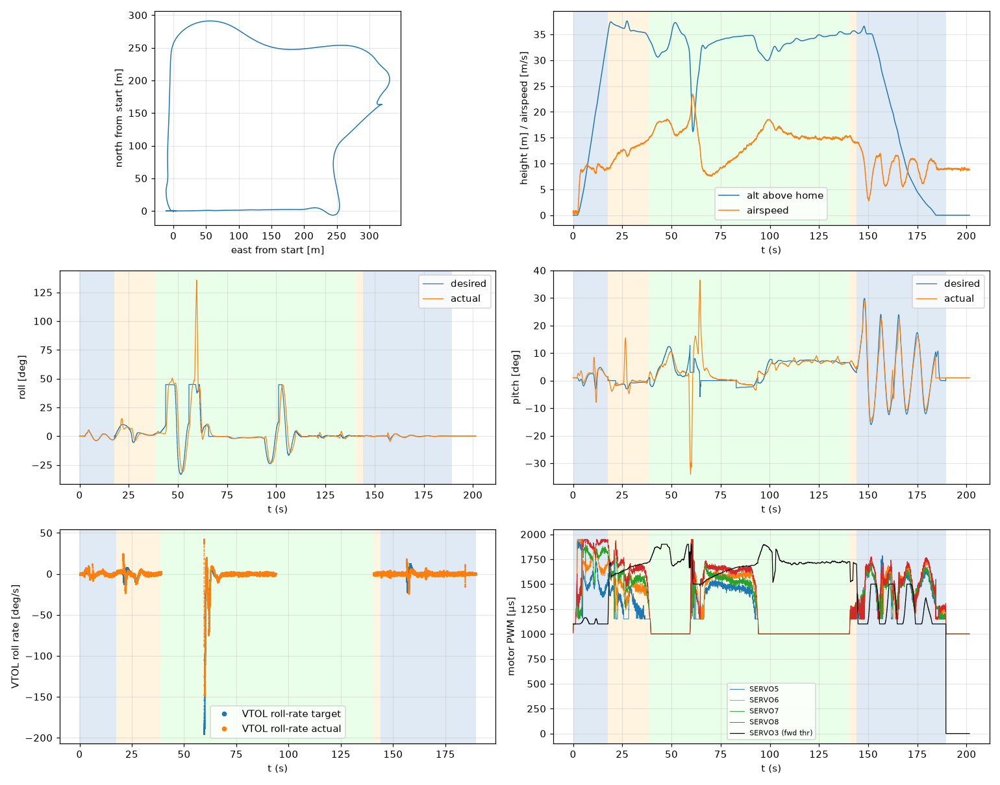

# Validation: pid_w9_s1

Log: `/home/trananhduy/quadplane-indi/rework/runs/noisy_wind/pid_w9_s1/flight.BIN`  
Mission completed (landed + disarmed): **True**

## Parameters read back from the log

| param | value |
|---|---|
| Q_ENABLE | 1.0 |
| Q_OPTIONS | 0.0 |
| Q_ASSIST_SPEED | 13.0 |
| AHRS_EKF_TYPE | 10.0 |
| SIM_WIND_SPD | 0.0 |
| AIRSPEED_CRUISE | 17.0 |
| AIRSPEED_MIN | 14.0 |
| AIRSPEED_STALL | 12.0 |
| Q_A_RAT_RLL_P | 0.699999988079071 |
| Q_A_RAT_RLL_I | 0.699999988079071 |
| Q_A_RAT_RLL_D | 0.029999999329447746 |
| Q_A_RAT_RLL_FF | 0.0 |
| Q_A_RAT_PIT_P | 0.30000001192092896 |
| Q_A_RAT_PIT_I | 0.30000001192092896 |
| Q_A_RAT_PIT_D | 0.02500000037252903 |
| Q_A_RAT_PIT_FF | 0.0 |
| Q_A_RAT_YAW_P | 4.0 |
| Q_A_RAT_YAW_I | 0.4000000059604645 |
| Q_A_RAT_YAW_D | 0.10000000149011612 |
| Q_A_ANG_RLL_P | 4.5 |
| Q_A_ANG_PIT_P | 4.5 |
| Q_A_ANG_YAW_P | 1.520650029182434 |
| RLL_RATE_P | 0.14106599986553192 |
| RLL_RATE_I | 0.17587700486183167 |
| RLL_RATE_D | 0.0015910000074654818 |
| RLL_RATE_FF | 0.17587700486183167 |
| PTCH_RATE_P | 0.2803190052509308 |
| PTCH_RATE_I | 0.8886290192604065 |
| PTCH_RATE_D | 0.004360999912023544 |
| PTCH_RATE_FF | 0.8886290192604065 |
| Q_M_PWM_MIN | 1000.0 |
| Q_M_PWM_MAX | 2000.0 |
| Q_M_SPIN_MIN | 0.15000000596046448 |
| Q_M_THST_HOVER | 0.3045985996723175 |
| Q_INDI_ENABLE | 0.0 |
| Q_INDI_AXES | None |
| Q_INDI_FILT_HZ | None |
| Q_INDI_RLL_K | None |
| Q_INDI_PIT_K | None |
| Q_INDI_RLL_G | None |
| Q_INDI_PIT_G | None |
| Q_INDI_ACT_TC | None |
| Q_INDI_ACT_DLY | None |
| Q_INDI_FW_RLL_G | None |
| Q_INDI_FW_PIT_G | None |
| Q_INDI_FW_TC | None |
| Q_INDI_FW_RLL_K | None |
| Q_INDI_FW_PIT_K | None |

## Events (s from log start)

- arm: -0.0
- transition_start: 17.7
- transition_done: 38.9
- back_transition: 140.5
- position2: 144.1
- land_complete: 189.5
- disarm: 189.5

## Phases

| phase | start | end | dur (s) | INDI on motors (% time) | INDI on surfaces (% time) |
|---|---|---|---|---|---|
| hover_takeoff | -0.0 | 17.7 | 17.7 | - | - |
| transition | 17.7 | 38.9 | 21.2 | - | - |
| fixed_wing | 38.9 | 140.5 | 101.6 | - | - |
| back_transition | 140.5 | 144.1 | 3.6 | - | - |
| hover_land | 144.1 | 189.5 | 45.4 | - | - |

## Attitude tracking (desired - actual, deg)

| phase | roll RMS | roll max | pitch RMS | pitch max | yaw RMS | yaw max |
|---|---|---|---|---|---|---|
| hover_takeoff | 0.18 | 0.57 | 2.03 | 7.42 | 4.01 | 94.91 |
| transition | 2.73 | 9.74 | 3.51 | 18.06 | - | - |
| fixed_wing | 11.61 | 97.30 | 5.56 | 42.21 | - | - |
| back_transition | 0.19 | 0.39 | 1.67 | 2.24 | - | - |
| hover_land | 0.54 | 3.74 | 2.56 | 9.76 | 0.38 | 2.05 |

## VTOL rate loop (PIQx target - actual, deg/s)

| phase | roll RMS | pitch RMS | yaw RMS | roll peak Hz | roll >5 Hz share / RMS (deg/s) | pitch peak Hz | pitch >5 Hz share / RMS (deg/s) |
|---|---|---|---|---|---|---|---|
| hover_takeoff | 1.31 | 10.30 | 22.46 | 0.14 | 0.19 / 1.024 | 0.56 | 0.01 / 0.576 |
| transition | 5.10 | 7.72 | 2.73 | 0.16 | 0.05 / 0.955 | 0.24 | 0.00 / 0.341 |
| back_transition | 0.91 | 1.01 | 0.70 | 1.39 | 0.49 / 0.681 | 0.23 | 0.03 / 0.143 |
| hover_land | 3.34 | 12.90 | 1.05 | 0.11 | 0.32 / 1.211 | 0.09 | 0.00 / 1.247 |

## VTOL height and motors

| phase | alt err RMS (m) | alt err max (m) | climb err RMS (m/s) | motor mean (0-1) | motor max | % any motor at max | % any motor at min |
|---|---|---|---|---|---|---|---|
| hover_takeoff | 0.09 | 0.42 | 0.34 | [0.515, 0.671, 0.646, 0.758] | [0.94, 0.95, 0.906, 0.95] | 0.0 | 9.71 |
| transition | 0.45 | 1.52 | 0.62 | [0.292, 0.474, 0.532, 0.657] | [0.73, 0.773, 0.784, 0.938] | 0.0 | 30.57 |
| back_transition | 0.32 | 0.48 | 0.42 | [0.187, 0.203, 0.188, 0.2] | [0.285, 0.292, 0.295, 0.318] | 0.0 | 98.89 |
| hover_land | 0.58 | 2.50 | 0.78 | [0.431, 0.464, 0.443, 0.48] | [0.787, 0.775, 0.715, 0.775] | 0.0 | 25.4 |

## Fixed-wing

### transition

- airspeed min/mean/max: 8.9 / 12.4 / 15.2 m/s; TECS speed-demand tracking RMS 4.82 m/s
- nav roll/pitch tracking RMS (CTUN): 2.71 / 3.50 deg (max 9.55 / 17.79)
- FW rate loop (PIDR/PIDP) RMS: 5.13 / 7.77 deg/s
- TECS height error RMS / max: 1.32 / 2.59 m
- cross-track RMS / max: 0.00 / 0.00 m
- throttle mean/max: 69.1 / 78.1 % (0.0 % of samples at max)
- VTOL assist active: 100.0 % of time; lift motors above idle: 100.0 % of samples

### fixed_wing

- airspeed min/mean/max: 7.5 / 14.7 / 23.4 m/s; TECS speed-demand tracking RMS 3.87 m/s
- nav roll/pitch tracking RMS (CTUN): 11.58 / 5.56 deg (max 97.09 / 41.36)
- FW rate loop (PIDR/PIDP) RMS: 16.85 / 8.32 deg/s
- TECS height error RMS / max: 3.51 / 18.83 m
- cross-track RMS / max: 36.61 / 81.46 m
- throttle mean/max: 76.4 / 100.0 % (4.6 % of samples at max)
- VTOL assist active: 33.7 % of time; lift motors above idle: 34.76 % of samples

## Mode changes

- 0.0 s: QHOVER
- 1.2 s: AUTO

## Autopilot messages

- -0.0 s: Throttle armed
- 0.0 s: ArduPlane V4.8.0-dev (7fa89979)
- 0.0 s: 158c274630044e33ab0c21188889c480
- 0.0 s: Param space used: 77/3840
- 0.0 s: RC Protocol: UDP
- 0.0 s: New mission
- 0.0 s: New rally
- 0.0 s: New fence
- 0.0 s: QuadPlane Frame: QUAD/X
- 0.0 s: GPS 1: probing for u-blox at 230400 baud
- 1.2 s: Mission: 1 Takeoff
- 3.2 s: Weathervane Active: nose in
- 17.7 s: Mission: 2 WP
- 17.7 s: Transition started airspeed 8.9
- 35.9 s: Transition airspeed reached 14.1
- 38.9 s: Transition done
- 43.7 s: Reached waypoint #2 dist 25m
- 43.7 s: Mission: 3 CondYaw
- 43.7 s: Mission: 4 WP
- 43.7 s: Skipping invalid cmd #115
- 55.5 s: Reached waypoint #4 dist 24m
- 55.5 s: Mission: 5 WP
- 59.4 s: Angle assist r=127 p=-28
- 59.4 s: Transition started airspeed 19.1
- 61.3 s: Transition airspeed reached 22.8
- 64.3 s: Transition done
- 64.5 s: Transition started airspeed 12.9
- 90.8 s: Transition airspeed reached 14.1
- 93.8 s: Transition done
- 101.2 s: Reached waypoint #5 dist 25m
- 101.2 s: Mission: 6 Land
- 101.2 s: VTOL approach d=253.0
- 140.5 s: VTOL airbrake v=6.2 d=22 sd=22 h=35.1
- 144.1 s: VTOL position1 v=5.2 d=2.6 h=35.4 dc=3.2
- 144.1 s: VTOL position2 started v=5.2 d=2.6 h=35.4
- 146.1 s: Weathervane Active: nose in
- 150.1 s: Weathervane Active: nose in
- 151.4 s: Land descend started
- 174.4 s: Land final started
- 189.5 s: Land complete
- 189.5 s: Throttle disarmed

