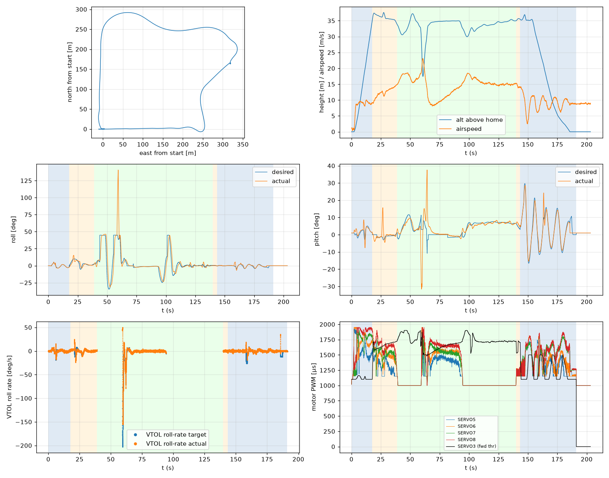

# Validation: pid_w9_s2

Log: `/home/trananhduy/quadplane-indi/rework/runs/noisy_wind/pid_w9_s2/flight.BIN`  
Mission completed (landed + disarmed): **True**

## Parameters read back from the log

| param | value |
|---|---|
| Q_ENABLE | 1.0 |
| Q_OPTIONS | 0.0 |
| Q_ASSIST_SPEED | 13.0 |
| AHRS_EKF_TYPE | 10.0 |
| SIM_WIND_SPD | 0.0 |
| AIRSPEED_CRUISE | 17.0 |
| AIRSPEED_MIN | 14.0 |
| AIRSPEED_STALL | 12.0 |
| Q_A_RAT_RLL_P | 0.699999988079071 |
| Q_A_RAT_RLL_I | 0.699999988079071 |
| Q_A_RAT_RLL_D | 0.029999999329447746 |
| Q_A_RAT_RLL_FF | 0.0 |
| Q_A_RAT_PIT_P | 0.30000001192092896 |
| Q_A_RAT_PIT_I | 0.30000001192092896 |
| Q_A_RAT_PIT_D | 0.02500000037252903 |
| Q_A_RAT_PIT_FF | 0.0 |
| Q_A_RAT_YAW_P | 4.0 |
| Q_A_RAT_YAW_I | 0.4000000059604645 |
| Q_A_RAT_YAW_D | 0.10000000149011612 |
| Q_A_ANG_RLL_P | 4.5 |
| Q_A_ANG_PIT_P | 4.5 |
| Q_A_ANG_YAW_P | 1.520650029182434 |
| RLL_RATE_P | 0.14106599986553192 |
| RLL_RATE_I | 0.17587700486183167 |
| RLL_RATE_D | 0.0015910000074654818 |
| RLL_RATE_FF | 0.17587700486183167 |
| PTCH_RATE_P | 0.2803190052509308 |
| PTCH_RATE_I | 0.8886290192604065 |
| PTCH_RATE_D | 0.004360999912023544 |
| PTCH_RATE_FF | 0.8886290192604065 |
| Q_M_PWM_MIN | 1000.0 |
| Q_M_PWM_MAX | 2000.0 |
| Q_M_SPIN_MIN | 0.15000000596046448 |
| Q_M_THST_HOVER | 0.304084837436676 |
| Q_INDI_ENABLE | 0.0 |
| Q_INDI_AXES | None |
| Q_INDI_FILT_HZ | None |
| Q_INDI_RLL_K | None |
| Q_INDI_PIT_K | None |
| Q_INDI_RLL_G | None |
| Q_INDI_PIT_G | None |
| Q_INDI_ACT_TC | None |
| Q_INDI_ACT_DLY | None |
| Q_INDI_FW_RLL_G | None |
| Q_INDI_FW_PIT_G | None |
| Q_INDI_FW_TC | None |
| Q_INDI_FW_RLL_K | None |
| Q_INDI_FW_PIT_K | None |

## Events (s from log start)

- arm: -0.0
- transition_start: 17.7
- transition_done: 38.8
- back_transition: 139.8
- position2: 143.4
- land_complete: 191.1
- disarm: 191.1

## Phases

| phase | start | end | dur (s) | INDI on motors (% time) | INDI on surfaces (% time) |
|---|---|---|---|---|---|
| hover_takeoff | -0.0 | 17.7 | 17.7 | - | - |
| transition | 17.7 | 38.8 | 21.1 | - | - |
| fixed_wing | 38.8 | 139.8 | 101.0 | - | - |
| back_transition | 139.8 | 143.4 | 3.6 | - | - |
| hover_land | 143.4 | 191.1 | 47.7 | - | - |

## Attitude tracking (desired - actual, deg)

| phase | roll RMS | roll max | pitch RMS | pitch max | yaw RMS | yaw max |
|---|---|---|---|---|---|---|
| hover_takeoff | 0.43 | 3.20 | 2.00 | 7.26 | 3.97 | 94.64 |
| transition | 2.66 | 9.33 | 3.49 | 18.05 | - | - |
| fixed_wing | 11.91 | 101.06 | 5.42 | 46.26 | - | - |
| back_transition | 0.20 | 0.35 | 1.58 | 2.12 | - | - |
| hover_land | 1.14 | 6.98 | 2.57 | 14.32 | 3.14 | 9.39 |

## VTOL rate loop (PIQx target - actual, deg/s)

| phase | roll RMS | pitch RMS | yaw RMS | roll peak Hz | roll >5 Hz share / RMS (deg/s) | pitch peak Hz | pitch >5 Hz share / RMS (deg/s) |
|---|---|---|---|---|---|---|---|
| hover_takeoff | 3.16 | 10.15 | 22.34 | 0.11 | 0.08 / 1.006 | 0.51 | 0.01 / 0.543 |
| transition | 5.10 | 7.69 | 2.55 | 0.16 | 0.05 / 0.952 | 0.28 | 0.00 / 0.325 |
| back_transition | 0.99 | 1.06 | 0.73 | 1.38 | 0.64 / 0.745 | 0.23 | 0.03 / 0.130 |
| hover_land | 4.77 | 13.03 | 6.70 | 0.10 | 0.12 / 1.224 | 0.09 | 0.00 / 0.582 |

## VTOL height and motors

| phase | alt err RMS (m) | alt err max (m) | climb err RMS (m/s) | motor mean (0-1) | motor max | % any motor at max | % any motor at min |
|---|---|---|---|---|---|---|---|
| hover_takeoff | 0.08 | 0.41 | 0.35 | [0.531, 0.682, 0.639, 0.753] | [0.945, 0.95, 0.901, 0.95] | 0.0 | 9.26 |
| transition | 0.46 | 1.54 | 0.63 | [0.308, 0.482, 0.521, 0.651] | [0.736, 0.781, 0.766, 0.904] | 0.0 | 27.51 |
| back_transition | 0.29 | 0.43 | 0.38 | [0.178, 0.194, 0.195, 0.204] | [0.305, 0.288, 0.295, 0.3] | 0.0 | 98.9 |
| hover_land | 0.60 | 2.50 | 0.79 | [0.336, 0.379, 0.508, 0.538] | [0.761, 0.816, 0.812, 0.875] | 0.0 | 48.03 |

## Fixed-wing

### transition

- airspeed min/mean/max: 8.9 / 12.4 / 14.9 m/s; TECS speed-demand tracking RMS 4.84 m/s
- nav roll/pitch tracking RMS (CTUN): 2.64 / 3.49 deg (max 9.20 / 17.80)
- FW rate loop (PIDR/PIDP) RMS: 5.13 / 7.74 deg/s
- TECS height error RMS / max: 1.31 / 2.58 m
- cross-track RMS / max: 0.00 / 0.00 m
- throttle mean/max: 69.2 / 78.3 % (0.0 % of samples at max)
- VTOL assist active: 100.0 % of time; lift motors above idle: 100.0 % of samples

### fixed_wing

- airspeed min/mean/max: 8.1 / 14.8 / 23.1 m/s; TECS speed-demand tracking RMS 3.67 m/s
- nav roll/pitch tracking RMS (CTUN): 11.87 / 5.41 deg (max 100.99 / 45.44)
- FW rate loop (PIDR/PIDP) RMS: 18.03 / 8.85 deg/s
- TECS height error RMS / max: 3.21 / 17.58 m
- cross-track RMS / max: 37.28 / 86.67 m
- throttle mean/max: 76.4 / 100.0 % (4.5 % of samples at max)
- VTOL assist active: 34.1 % of time; lift motors above idle: 35.37 % of samples

## Mode changes

- 0.0 s: QHOVER
- 1.1 s: AUTO

## Autopilot messages

- -0.0 s: Throttle armed
- 0.0 s: ArduPlane V4.8.0-dev (7fa89979)
- 0.0 s: 158c274630044e33ab0c21188889c480
- 0.0 s: Param space used: 85/3840
- 0.0 s: RC Protocol: UDP
- 0.0 s: New mission
- 0.0 s: New rally
- 0.0 s: New fence
- 0.0 s: QuadPlane Frame: QUAD/X
- 0.0 s: GPS 1: probing for u-blox at 230400 baud
- 1.1 s: Mission: 1 Takeoff
- 3.1 s: Weathervane Active: nose in
- 17.7 s: Mission: 2 WP
- 17.7 s: Transition started airspeed 9.2
- 35.8 s: Transition airspeed reached 14.0
- 38.8 s: Transition done
- 43.6 s: Reached waypoint #2 dist 25m
- 43.6 s: Mission: 3 CondYaw
- 43.6 s: Mission: 4 WP
- 43.6 s: Skipping invalid cmd #115
- 55.3 s: Reached waypoint #4 dist 24m
- 55.3 s: Mission: 5 WP
- 59.2 s: Angle assist r=130 p=-24
- 59.2 s: Transition started airspeed 18.5
- 60.8 s: Transition airspeed reached 23.0
- 63.8 s: Transition done
- 64.4 s: Transition started airspeed 12.7
- 91.2 s: Transition airspeed reached 14.0
- 94.2 s: Transition done
- 101.0 s: Reached waypoint #5 dist 25m
- 101.0 s: Mission: 6 Land
- 101.0 s: VTOL approach d=253.3
- 139.8 s: VTOL airbrake v=6.3 d=22 sd=22 h=35.0
- 143.4 s: VTOL position1 v=5.2 d=2.6 h=35.4 dc=3.1
- 143.4 s: VTOL position2 started v=5.2 d=2.6 h=35.4
- 145.4 s: Weathervane Active: nose in
- 149.4 s: Weathervane Active: nose in
- 152.9 s: Land descend started
- 175.6 s: Land final started
- 191.1 s: Land complete
- 191.1 s: Throttle disarmed

