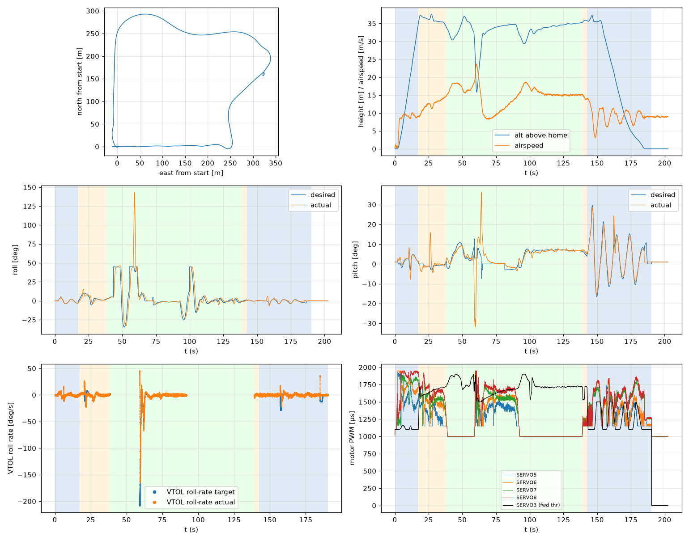

# Validation: pid_w9_s3

Log: `/home/trananhduy/quadplane-indi/rework/runs/noisy_wind/pid_w9_s3/flight.BIN`  
Mission completed (landed + disarmed): **True**

## Parameters read back from the log

| param | value |
|---|---|
| Q_ENABLE | 1.0 |
| Q_OPTIONS | 0.0 |
| Q_ASSIST_SPEED | 13.0 |
| AHRS_EKF_TYPE | 10.0 |
| SIM_WIND_SPD | 0.0 |
| AIRSPEED_CRUISE | 17.0 |
| AIRSPEED_MIN | 14.0 |
| AIRSPEED_STALL | 12.0 |
| Q_A_RAT_RLL_P | 0.699999988079071 |
| Q_A_RAT_RLL_I | 0.699999988079071 |
| Q_A_RAT_RLL_D | 0.029999999329447746 |
| Q_A_RAT_RLL_FF | 0.0 |
| Q_A_RAT_PIT_P | 0.30000001192092896 |
| Q_A_RAT_PIT_I | 0.30000001192092896 |
| Q_A_RAT_PIT_D | 0.02500000037252903 |
| Q_A_RAT_PIT_FF | 0.0 |
| Q_A_RAT_YAW_P | 4.0 |
| Q_A_RAT_YAW_I | 0.4000000059604645 |
| Q_A_RAT_YAW_D | 0.10000000149011612 |
| Q_A_ANG_RLL_P | 4.5 |
| Q_A_ANG_PIT_P | 4.5 |
| Q_A_ANG_YAW_P | 1.520650029182434 |
| RLL_RATE_P | 0.14106599986553192 |
| RLL_RATE_I | 0.17587700486183167 |
| RLL_RATE_D | 0.0015910000074654818 |
| RLL_RATE_FF | 0.17587700486183167 |
| PTCH_RATE_P | 0.2803190052509308 |
| PTCH_RATE_I | 0.8886290192604065 |
| PTCH_RATE_D | 0.004360999912023544 |
| PTCH_RATE_FF | 0.8886290192604065 |
| Q_M_PWM_MIN | 1000.0 |
| Q_M_PWM_MAX | 2000.0 |
| Q_M_SPIN_MIN | 0.15000000596046448 |
| Q_M_THST_HOVER | 0.3034382164478302 |
| Q_INDI_ENABLE | 0.0 |
| Q_INDI_AXES | None |
| Q_INDI_FILT_HZ | None |
| Q_INDI_RLL_K | None |
| Q_INDI_PIT_K | None |
| Q_INDI_RLL_G | None |
| Q_INDI_PIT_G | None |
| Q_INDI_ACT_TC | None |
| Q_INDI_ACT_DLY | None |
| Q_INDI_FW_RLL_G | None |
| Q_INDI_FW_PIT_G | None |
| Q_INDI_FW_TC | None |
| Q_INDI_FW_RLL_K | None |
| Q_INDI_FW_PIT_K | None |

## Events (s from log start)

- arm: -0.0
- transition_start: 17.4
- transition_done: 38.3
- back_transition: 138.9
- position2: 142.5
- land_complete: 190.3
- disarm: 190.3

## Phases

| phase | start | end | dur (s) | INDI on motors (% time) | INDI on surfaces (% time) |
|---|---|---|---|---|---|
| hover_takeoff | -0.0 | 17.4 | 17.4 | - | - |
| transition | 17.4 | 38.3 | 20.9 | - | - |
| fixed_wing | 38.3 | 138.9 | 100.6 | - | - |
| back_transition | 138.9 | 142.5 | 3.6 | - | - |
| hover_land | 142.5 | 190.3 | 47.8 | - | - |

## Attitude tracking (desired - actual, deg)

| phase | roll RMS | roll max | pitch RMS | pitch max | yaw RMS | yaw max |
|---|---|---|---|---|---|---|
| hover_takeoff | 0.25 | 1.54 | 2.04 | 7.41 | 4.02 | 94.61 |
| transition | 2.75 | 9.67 | 3.59 | 18.27 | - | - |
| fixed_wing | 12.20 | 103.87 | 5.37 | 40.49 | - | - |
| back_transition | 0.79 | 1.16 | 1.09 | 1.28 | - | - |
| hover_land | 1.16 | 7.30 | 2.61 | 14.12 | 2.91 | 9.37 |

## VTOL rate loop (PIQx target - actual, deg/s)

| phase | roll RMS | pitch RMS | yaw RMS | roll peak Hz | roll >5 Hz share / RMS (deg/s) | pitch peak Hz | pitch >5 Hz share / RMS (deg/s) |
|---|---|---|---|---|---|---|---|
| hover_takeoff | 2.04 | 10.36 | 22.48 | 0.14 | 0.16 / 1.089 | 0.57 | 0.01 / 0.608 |
| transition | 5.13 | 7.82 | 2.69 | 0.16 | 0.05 / 0.940 | 0.24 | 0.00 / 0.329 |
| back_transition | 1.22 | 0.95 | 0.89 | 0.23 | 0.50 / 0.724 | 0.23 | 0.06 / 0.130 |
| hover_land | 4.96 | 13.11 | 6.35 | 0.10 | 0.12 / 1.209 | 0.09 | 0.00 / 0.556 |

## VTOL height and motors

| phase | alt err RMS (m) | alt err max (m) | climb err RMS (m/s) | motor mean (0-1) | motor max | % any motor at max | % any motor at min |
|---|---|---|---|---|---|---|---|
| hover_takeoff | 0.09 | 0.41 | 0.36 | [0.528, 0.683, 0.647, 0.761] | [0.934, 0.95, 0.902, 0.95] | 0.0 | 9.17 |
| transition | 0.47 | 1.60 | 0.65 | [0.301, 0.475, 0.526, 0.655] | [0.738, 0.77, 0.777, 0.921] | 0.0 | 30.08 |
| back_transition | 0.20 | 0.29 | 0.26 | [0.2, 0.207, 0.179, 0.185] | [0.269, 0.28, 0.295, 0.295] | 0.0 | 100.0 |
| hover_land | 0.59 | 2.50 | 0.79 | [0.335, 0.376, 0.51, 0.538] | [0.763, 0.815, 0.818, 0.878] | 0.0 | 48.41 |

## Fixed-wing

### transition

- airspeed min/mean/max: 8.9 / 12.4 / 14.9 m/s; TECS speed-demand tracking RMS 4.87 m/s
- nav roll/pitch tracking RMS (CTUN): 2.74 / 3.59 deg (max 9.54 / 18.02)
- FW rate loop (PIDR/PIDP) RMS: 5.16 / 7.87 deg/s
- TECS height error RMS / max: 1.29 / 2.59 m
- cross-track RMS / max: 0.00 / 0.00 m
- throttle mean/max: 69.2 / 78.6 % (0.0 % of samples at max)
- VTOL assist active: 99.8 % of time; lift motors above idle: 100.0 % of samples

### fixed_wing

- airspeed min/mean/max: 8.2 / 14.9 / 23.7 m/s; TECS speed-demand tracking RMS 3.65 m/s
- nav roll/pitch tracking RMS (CTUN): 12.14 / 5.36 deg (max 103.63 / 39.02)
- FW rate loop (PIDR/PIDP) RMS: 18.67 / 7.93 deg/s
- TECS height error RMS / max: 3.66 / 19.19 m
- cross-track RMS / max: 39.68 / 89.13 m
- throttle mean/max: 76.9 / 100.0 % (4.1 % of samples at max)
- VTOL assist active: 32.4 % of time; lift motors above idle: 33.72 % of samples

## Mode changes

- 0.0 s: QHOVER
- 1.1 s: AUTO

## Autopilot messages

- -0.0 s: Throttle armed
- 0.0 s: ArduPlane V4.8.0-dev (7fa89979)
- 0.0 s: 158c274630044e33ab0c21188889c480
- 0.0 s: Param space used: 77/3840
- 0.0 s: RC Protocol: UDP
- 0.0 s: New mission
- 0.0 s: New rally
- 0.0 s: New fence
- 0.0 s: QuadPlane Frame: QUAD/X
- 0.0 s: GPS 1: probing for u-blox at 230400 baud
- 1.1 s: Mission: 1 Takeoff
- 3.1 s: Weathervane Active: nose in
- 17.4 s: Mission: 2 WP
- 17.4 s: Transition started airspeed 9.0
- 35.3 s: Transition airspeed reached 14.1
- 38.3 s: Transition done
- 38.4 s: EKF3 IMU0 is using GPS
- 43.3 s: Reached waypoint #2 dist 25m
- 43.3 s: Mission: 3 CondYaw
- 43.3 s: Mission: 4 WP
- 43.3 s: Skipping invalid cmd #115
- 55.1 s: Reached waypoint #4 dist 24m
- 55.1 s: Mission: 5 WP
- 59.0 s: Angle assist r=129 p=-26
- 59.0 s: Transition started airspeed 18.9
- 61.0 s: Transition airspeed reached 22.9
- 64.0 s: Transition done
- 64.3 s: Transition started airspeed 12.7
- 88.8 s: Transition airspeed reached 14.0
- 91.8 s: Transition done
- 99.8 s: Reached waypoint #5 dist 25m
- 99.8 s: Mission: 6 Land
- 99.8 s: VTOL approach d=253.3
- 138.9 s: VTOL airbrake v=6.1 d=21 sd=22 h=35.3
- 142.5 s: VTOL position1 v=5.1 d=2.7 h=35.8 dc=3.1
- 142.5 s: VTOL position2 started v=5.1 d=2.7 h=35.8
- 144.5 s: Weathervane Active: nose in
- 148.4 s: Weathervane Active: nose in
- 151.9 s: Land descend started
- 174.8 s: Land final started
- 190.3 s: Land complete
- 190.3 s: Throttle disarmed

