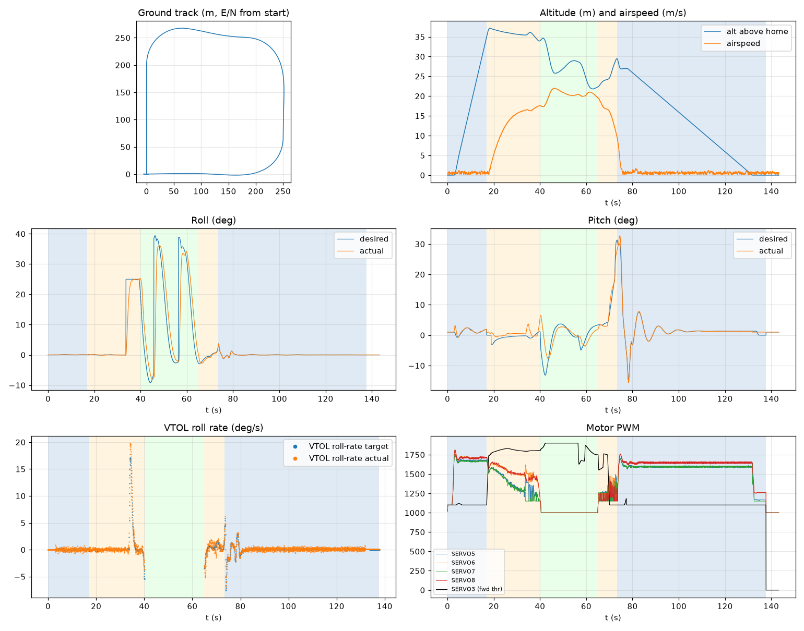

# Validation: pid_calm_01

Log: `/home/trananhduy/quadplane-indi/rework/runs/pid_calm_01/flight.BIN`  
Mission completed (landed + disarmed): **True**

## Parameters read back from the log

| param | value |
|---|---|
| Q_ENABLE | 1.0 |
| Q_OPTIONS | 0.0 |
| Q_ASSIST_SPEED | 16.66666603088379 |
| AHRS_EKF_TYPE | 10.0 |
| SIM_WIND_SPD | 0.0 |
| AIRSPEED_CRUISE | 20.83333396911621 |
| AIRSPEED_MIN | 16.0 |
| AIRSPEED_STALL | 16.66666603088379 |
| Q_A_RAT_RLL_P | 0.699999988079071 |
| Q_A_RAT_RLL_I | 0.699999988079071 |
| Q_A_RAT_RLL_D | 0.029999999329447746 |
| Q_A_RAT_RLL_FF | 0.0 |
| Q_A_RAT_PIT_P | 0.30000001192092896 |
| Q_A_RAT_PIT_I | 0.30000001192092896 |
| Q_A_RAT_PIT_D | 0.02500000037252903 |
| Q_A_RAT_PIT_FF | 0.0 |
| Q_A_RAT_YAW_P | 4.0 |
| Q_A_RAT_YAW_I | 0.4000000059604645 |
| Q_A_RAT_YAW_D | 0.10000000149011612 |
| Q_A_ANG_RLL_P | 4.5 |
| Q_A_ANG_PIT_P | 4.5 |
| Q_A_ANG_YAW_P | 1.520650029182434 |
| RLL_RATE_P | 0.14106599986553192 |
| RLL_RATE_I | 0.17587700486183167 |
| RLL_RATE_D | 0.0015910000074654818 |
| RLL_RATE_FF | 0.17587700486183167 |
| PTCH_RATE_P | 0.2803190052509308 |
| PTCH_RATE_I | 0.8886290192604065 |
| PTCH_RATE_D | 0.004360999912023544 |
| PTCH_RATE_FF | 0.8886290192604065 |
| Q_M_PWM_MIN | 1000.0 |
| Q_M_PWM_MAX | 2000.0 |
| Q_M_SPIN_MIN | 0.15000000596046448 |
| Q_M_THST_HOVER | 0.3120647072792053 |

## Events (s from log start)

- arm: -0.0
- transition_start: 16.9
- transition_done: 40.0
- back_transition: 64.9
- position2: 73.3
- land_complete: 137.7
- disarm: 137.7

## Phases

| phase | start | end | dur (s) |
|---|---|---|---|
| hover_takeoff | -0.0 | 16.9 | 17.0 |
| transition | 16.9 | 40.0 | 23.1 |
| fixed_wing | 40.0 | 64.9 | 24.9 |
| back_transition | 64.9 | 73.3 | 8.4 |
| hover_land | 73.3 | 137.7 | 64.4 |

## Attitude tracking (desired - actual, deg)

| phase | roll RMS | roll max | pitch RMS | pitch max | yaw RMS | yaw max |
|---|---|---|---|---|---|---|
| hover_takeoff | 0.01 | 0.04 | 0.53 | 2.60 | 0.05 | 0.09 |
| transition | 4.08 | 25.00 | 1.54 | 4.65 | - | - |
| fixed_wing | 11.43 | 46.01 | 3.79 | 12.15 | - | - |
| back_transition | 0.73 | 2.98 | 1.73 | 4.04 | - | - |
| hover_land | 0.04 | 0.31 | 0.48 | 3.27 | 0.08 | 0.55 |

## VTOL rate loop (PIQx target - actual, deg/s)

| phase | roll RMS | pitch RMS | yaw RMS | roll peak Hz | roll >5 Hz share / RMS (deg/s) | pitch peak Hz | pitch >5 Hz share / RMS (deg/s) |
|---|---|---|---|---|---|---|---|
| hover_takeoff | 0.23 | 2.67 | 0.17 | 17.15 | 0.82 / 0.202 | 0.10 | 0.15 / 0.393 |
| transition | 0.75 | 2.78 | 2.46 | 0.04 | 0.00 / 0.139 | 0.04 | 0.01 / 0.271 |
| back_transition | 0.91 | 4.59 | 1.49 | 1.39 | 0.01 / 0.199 | 0.10 | 0.00 / 0.293 |
| hover_land | 0.25 | 2.28 | 0.23 | 12.21 | 0.81 / 0.195 | 12.21 | 0.36 / 0.516 |

## VTOL height and motors

| phase | alt err RMS (m) | alt err max (m) | climb err RMS (m/s) | motor mean (0-1) | motor max | % any motor at max | % any motor at min |
|---|---|---|---|---|---|---|---|
| hover_takeoff | 0.18 | 0.77 | 0.32 | [0.59, 0.625, 0.586, 0.622] | [0.769, 0.817, 0.752, 0.811] | 0.0 | 12.74 |
| transition | 0.38 | 1.41 | 0.30 | [0.388, 0.529, 0.355, 0.524] | [0.683, 0.717, 0.669, 0.72] | 0.0 | 24.57 |
| back_transition | 1.79 | 2.50 | 2.74 | [0.236, 0.249, 0.214, 0.215] | [0.495, 0.477, 0.427, 0.437] | 0.0 | 100.0 |
| hover_land | 0.54 | 2.50 | 0.65 | [0.558, 0.611, 0.556, 0.612] | [0.702, 0.761, 0.699, 0.762] | 0.0 | 8.45 |

## Fixed-wing

### transition

- airspeed min/mean/max: 0.1 / 12.6 / 17.6 m/s; TECS speed-demand tracking RMS 9.54 m/s
- nav roll/pitch tracking RMS (CTUN): 4.08 / 1.54 deg (max 25.00 / 4.65)
- FW rate loop (PIDR/PIDP) RMS: 0.73 / 2.79 deg/s
- TECS height error RMS / max: 1.13 / 2.15 m
- cross-track RMS / max: 16.16 / 64.81 m
- throttle mean/max: 86.3 / 91.7 % (0.0 % of samples at max)
- VTOL assist active: 100.0 % of time; lift motors above idle: 100.0 % of samples

### fixed_wing

- airspeed min/mean/max: 17.3 / 20.3 / 22.0 m/s; TECS speed-demand tracking RMS 1.65 m/s
- nav roll/pitch tracking RMS (CTUN): 11.43 / 3.79 deg (max 46.00 / 12.14)
- FW rate loop (PIDR/PIDP) RMS: 5.18 / 2.32 deg/s
- TECS height error RMS / max: 6.77 / 9.23 m
- cross-track RMS / max: 28.37 / 84.48 m
- throttle mean/max: 93.2 / 100.0 % (57.6 % of samples at max)
- VTOL assist active: 0.0 % of time; lift motors above idle: 1.45 % of samples

## Mode changes

- -0.0 s: QHOVER
- 2.0 s: AUTO

## Autopilot messages

- -0.0 s: Throttle armed
- -0.0 s: ArduPlane V4.8.0-dev (9f648cca)
- -0.0 s: 158c274630044e33ab0c21188889c480
- -0.0 s: Param space used: 69/3840
- -0.0 s: RC Protocol: UDP
- -0.0 s: New mission
- -0.0 s: New rally
- -0.0 s: New fence
- -0.0 s: QuadPlane Frame: QUAD/X
- -0.0 s: GPS 1: probing for u-blox at 230400 baud
- 2.0 s: Mission: 1 Takeoff
- 3.0 s: EKF3 IMU0 origin set
- 3.0 s: EKF3 IMU1 origin set
- 4.0 s: Weathervane Active: nose in
- 16.9 s: Mission: 2 WP
- 16.9 s: Transition started airspeed 0.6
- 33.5 s: Reached waypoint #2 dist 66m
- 33.5 s: Mission: 3 CondYaw
- 33.5 s: Mission: 4 WP
- 33.5 s: Skipping invalid cmd #115
- 37.0 s: Transition airspeed reached 16.7
- 40.0 s: Transition done
- 40.2 s: EKF3 IMU0 is using GPS
- 40.2 s: EKF3 IMU1 is using GPS
- 45.6 s: Reached waypoint #4 dist 86m
- 45.6 s: Mission: 5 WP
- 56.3 s: Reached waypoint #5 dist 82m
- 56.3 s: Mission: 6 Land
- 56.3 s: VTOL approach d=264.7
- 64.9 s: VTOL airbrake v=19.4 d=133 sd=133 h=22.3
- 69.2 s: VTOL position1 v=16.6 d=57.0 h=24.2 dc=15.1
- 73.3 s: VTOL position2 started v=9.0 d=3.3 h=29.5
- 75.6 s: Weathervane Active: nose in
- 77.3 s: Land descend started
- 77.4 s: Land final started
- 137.7 s: Land complete
- 137.7 s: Throttle disarmed

