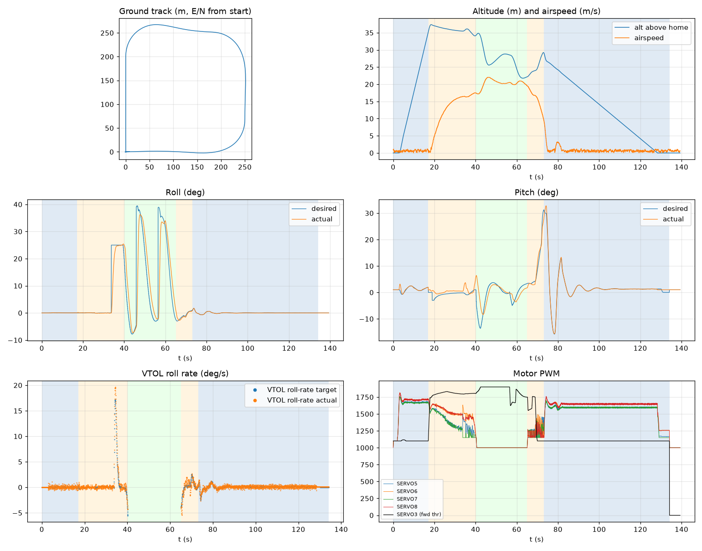

# Validation: pid_calm_02

Log: `/home/trananhduy/quadplane-indi/rework/runs/pid_calm_02/flight.BIN`  
Mission completed (landed + disarmed): **True**

## Parameters read back from the log

| param | value |
|---|---|
| Q_ENABLE | 1.0 |
| Q_OPTIONS | 0.0 |
| Q_ASSIST_SPEED | 16.66666603088379 |
| AHRS_EKF_TYPE | 10.0 |
| SIM_WIND_SPD | 0.0 |
| AIRSPEED_CRUISE | 20.83333396911621 |
| AIRSPEED_MIN | 16.0 |
| AIRSPEED_STALL | 16.66666603088379 |
| Q_A_RAT_RLL_P | 0.699999988079071 |
| Q_A_RAT_RLL_I | 0.699999988079071 |
| Q_A_RAT_RLL_D | 0.029999999329447746 |
| Q_A_RAT_RLL_FF | 0.0 |
| Q_A_RAT_PIT_P | 0.30000001192092896 |
| Q_A_RAT_PIT_I | 0.30000001192092896 |
| Q_A_RAT_PIT_D | 0.02500000037252903 |
| Q_A_RAT_PIT_FF | 0.0 |
| Q_A_RAT_YAW_P | 4.0 |
| Q_A_RAT_YAW_I | 0.4000000059604645 |
| Q_A_RAT_YAW_D | 0.10000000149011612 |
| Q_A_ANG_RLL_P | 4.5 |
| Q_A_ANG_PIT_P | 4.5 |
| Q_A_ANG_YAW_P | 1.520650029182434 |
| RLL_RATE_P | 0.14106599986553192 |
| RLL_RATE_I | 0.17587700486183167 |
| RLL_RATE_D | 0.0015910000074654818 |
| RLL_RATE_FF | 0.17587700486183167 |
| PTCH_RATE_P | 0.2803190052509308 |
| PTCH_RATE_I | 0.8886290192604065 |
| PTCH_RATE_D | 0.004360999912023544 |
| PTCH_RATE_FF | 0.8886290192604065 |
| Q_M_PWM_MIN | 1000.0 |
| Q_M_PWM_MAX | 2000.0 |
| Q_M_SPIN_MIN | 0.15000000596046448 |
| Q_M_THST_HOVER | 0.29800230264663696 |

## Events (s from log start)

- arm: -0.0
- transition_start: 17.0
- transition_done: 40.1
- back_transition: 65.0
- position2: 73.1
- land_complete: 134.1
- disarm: 134.1

## Phases

| phase | start | end | dur (s) |
|---|---|---|---|
| hover_takeoff | -0.0 | 17.0 | 17.1 |
| transition | 17.0 | 40.1 | 23.1 |
| fixed_wing | 40.1 | 65.0 | 24.9 |
| back_transition | 65.0 | 73.1 | 8.1 |
| hover_land | 73.1 | 134.1 | 61.0 |

## Attitude tracking (desired - actual, deg)

| phase | roll RMS | roll max | pitch RMS | pitch max | yaw RMS | yaw max |
|---|---|---|---|---|---|---|
| hover_takeoff | 0.02 | 0.05 | 0.53 | 2.58 | 0.05 | 0.10 |
| transition | 4.15 | 24.99 | 1.56 | 4.86 | - | - |
| fixed_wing | 10.94 | 44.22 | 3.87 | 12.55 | - | - |
| back_transition | 0.83 | 3.38 | 1.82 | 4.23 | - | - |
| hover_land | 0.03 | 0.24 | 0.49 | 3.34 | 0.08 | 0.57 |

## VTOL rate loop (PIQx target - actual, deg/s)

| phase | roll RMS | pitch RMS | yaw RMS | roll peak Hz | roll >5 Hz share / RMS (deg/s) | pitch peak Hz | pitch >5 Hz share / RMS (deg/s) |
|---|---|---|---|---|---|---|---|
| hover_takeoff | 0.26 | 2.66 | 0.17 | 16.63 | 0.79 / 0.207 | 0.10 | 0.16 / 0.397 |
| transition | 0.72 | 2.84 | 2.49 | 0.04 | 0.00 / 0.150 | 0.04 | 0.01 / 0.235 |
| back_transition | 0.87 | 4.83 | 1.47 | 0.31 | 0.01 / 0.175 | 0.10 | 0.00 / 0.316 |
| hover_land | 0.23 | 2.32 | 0.20 | 12.21 | 0.83 / 0.194 | 0.10 | 0.29 / 0.503 |

## VTOL height and motors

| phase | alt err RMS (m) | alt err max (m) | climb err RMS (m/s) | motor mean (0-1) | motor max | % any motor at max | % any motor at min |
|---|---|---|---|---|---|---|---|
| hover_takeoff | 0.18 | 0.77 | 0.32 | [0.589, 0.625, 0.585, 0.621] | [0.76, 0.816, 0.753, 0.811] | 0.0 | 12.88 |
| transition | 0.37 | 1.27 | 0.30 | [0.389, 0.528, 0.353, 0.522] | [0.68, 0.716, 0.672, 0.722] | 0.0 | 24.09 |
| back_transition | 1.79 | 2.50 | 2.76 | [0.238, 0.248, 0.211, 0.214] | [0.458, 0.494, 0.402, 0.41] | 0.0 | 100.0 |
| hover_land | 0.54 | 2.50 | 0.66 | [0.557, 0.61, 0.554, 0.61] | [0.698, 0.749, 0.699, 0.762] | 0.0 | 8.66 |

## Fixed-wing

### transition

- airspeed min/mean/max: 0.1 / 12.5 / 17.5 m/s; TECS speed-demand tracking RMS 9.57 m/s
- nav roll/pitch tracking RMS (CTUN): 4.15 / 1.56 deg (max 24.99 / 4.85)
- FW rate loop (PIDR/PIDP) RMS: 0.70 / 2.85 deg/s
- TECS height error RMS / max: 1.18 / 2.22 m
- cross-track RMS / max: 16.06 / 64.81 m
- throttle mean/max: 86.3 / 91.6 % (0.0 % of samples at max)
- VTOL assist active: 100.0 % of time; lift motors above idle: 100.0 % of samples

### fixed_wing

- airspeed min/mean/max: 17.2 / 20.3 / 22.0 m/s; TECS speed-demand tracking RMS 1.66 m/s
- nav roll/pitch tracking RMS (CTUN): 10.94 / 3.87 deg (max 44.21 / 12.54)
- FW rate loop (PIDR/PIDP) RMS: 5.49 / 2.21 deg/s
- TECS height error RMS / max: 6.79 / 9.42 m
- cross-track RMS / max: 28.59 / 84.38 m
- throttle mean/max: 93.0 / 100.0 % (57.0 % of samples at max)
- VTOL assist active: 0.0 % of time; lift motors above idle: 1.61 % of samples

## Mode changes

- -0.0 s: QHOVER
- 2.0 s: AUTO

## Autopilot messages

- -0.0 s: Throttle armed
- -0.0 s: ArduPlane V4.8.0-dev (9f648cca)
- -0.0 s: 158c274630044e33ab0c21188889c480
- -0.0 s: Param space used: 77/3840
- -0.0 s: RC Protocol: UDP
- -0.0 s: New mission
- -0.0 s: New rally
- -0.0 s: New fence
- -0.0 s: QuadPlane Frame: QUAD/X
- -0.0 s: GPS 1: probing for u-blox at 230400 baud
- 2.0 s: Mission: 1 Takeoff
- 3.0 s: EKF3 IMU1 origin set
- 3.0 s: EKF3 IMU0 origin set
- 4.0 s: Weathervane Active: nose in
- 17.0 s: Mission: 2 WP
- 17.0 s: Transition started airspeed 0.7
- 33.6 s: Reached waypoint #2 dist 66m
- 33.6 s: Mission: 3 CondYaw
- 33.6 s: Mission: 4 WP
- 33.6 s: Skipping invalid cmd #115
- 37.1 s: Transition airspeed reached 16.7
- 40.1 s: Transition done
- 40.2 s: EKF3 IMU0 is using GPS
- 40.2 s: EKF3 IMU1 is using GPS
- 45.7 s: Reached waypoint #4 dist 86m
- 45.7 s: Mission: 5 WP
- 56.4 s: Reached waypoint #5 dist 82m
- 56.4 s: Mission: 6 Land
- 56.4 s: VTOL approach d=264.5
- 65.0 s: VTOL airbrake v=19.4 d=133 sd=133 h=22.2
- 68.9 s: VTOL position1 v=16.7 d=63.7 h=24.0 dc=16.0
- 73.1 s: VTOL position2 started v=9.0 d=8.8 h=29.2
- 74.2 s: Land descend started
- 74.3 s: Land final started
- 75.3 s: Weathervane Active: nose in
- 134.1 s: Land complete
- 134.1 s: Throttle disarmed

