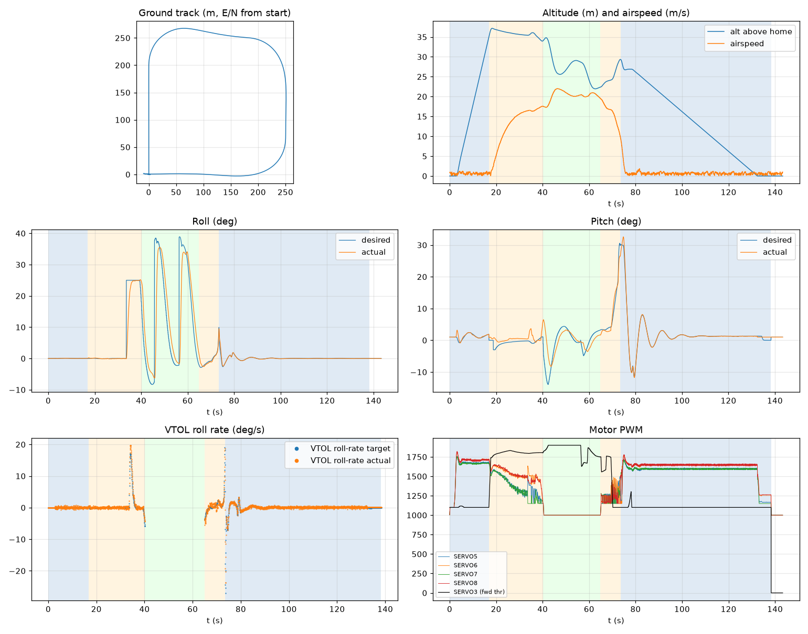

# Validation: reg_indi_branch_pid

Log: `/home/trananhduy/quadplane-indi/rework/runs/reg_indi_branch_pid/flight.BIN`  
Mission completed (landed + disarmed): **True**

## Parameters read back from the log

| param | value |
|---|---|
| Q_ENABLE | 1.0 |
| Q_OPTIONS | 0.0 |
| Q_ASSIST_SPEED | 16.66666603088379 |
| AHRS_EKF_TYPE | 10.0 |
| SIM_WIND_SPD | 0.0 |
| AIRSPEED_CRUISE | 20.83333396911621 |
| AIRSPEED_MIN | 16.0 |
| AIRSPEED_STALL | 16.66666603088379 |
| Q_A_RAT_RLL_P | 0.699999988079071 |
| Q_A_RAT_RLL_I | 0.699999988079071 |
| Q_A_RAT_RLL_D | 0.029999999329447746 |
| Q_A_RAT_RLL_FF | 0.0 |
| Q_A_RAT_PIT_P | 0.30000001192092896 |
| Q_A_RAT_PIT_I | 0.30000001192092896 |
| Q_A_RAT_PIT_D | 0.02500000037252903 |
| Q_A_RAT_PIT_FF | 0.0 |
| Q_A_RAT_YAW_P | 4.0 |
| Q_A_RAT_YAW_I | 0.4000000059604645 |
| Q_A_RAT_YAW_D | 0.10000000149011612 |
| Q_A_ANG_RLL_P | 4.5 |
| Q_A_ANG_PIT_P | 4.5 |
| Q_A_ANG_YAW_P | 1.520650029182434 |
| RLL_RATE_P | 0.14106599986553192 |
| RLL_RATE_I | 0.17587700486183167 |
| RLL_RATE_D | 0.0015910000074654818 |
| RLL_RATE_FF | 0.17587700486183167 |
| PTCH_RATE_P | 0.2803190052509308 |
| PTCH_RATE_I | 0.8886290192604065 |
| PTCH_RATE_D | 0.004360999912023544 |
| PTCH_RATE_FF | 0.8886290192604065 |
| Q_M_PWM_MIN | 1000.0 |
| Q_M_PWM_MAX | 2000.0 |
| Q_M_SPIN_MIN | 0.15000000596046448 |
| Q_M_THST_HOVER | 0.3068651556968689 |
| Q_INDI_ENABLE | 0.0 |
| Q_INDI_AXES | None |
| Q_INDI_FILT_HZ | None |
| Q_INDI_RLL_K | None |
| Q_INDI_PIT_K | None |
| Q_INDI_RLL_G | None |
| Q_INDI_PIT_G | None |
| Q_INDI_ACT_TC | None |
| Q_INDI_ACT_DLY | None |
| Q_INDI_FW_RLL_G | None |
| Q_INDI_FW_PIT_G | None |
| Q_INDI_FW_TC | None |
| Q_INDI_FW_RLL_K | None |
| Q_INDI_FW_PIT_K | None |

## Events (s from log start)

- arm: -0.0
- transition_start: 16.9
- transition_done: 40.1
- back_transition: 64.9
- position2: 73.5
- land_complete: 138.3
- disarm: 138.3

## Phases

| phase | start | end | dur (s) | INDI on motors (% time) | INDI on surfaces (% time) |
|---|---|---|---|---|---|
| hover_takeoff | -0.0 | 16.9 | 16.9 | - | - |
| transition | 16.9 | 40.1 | 23.2 | - | - |
| fixed_wing | 40.1 | 64.9 | 24.8 | - | - |
| back_transition | 64.9 | 73.5 | 8.6 | - | - |
| hover_land | 73.5 | 138.3 | 64.8 | - | - |

## Attitude tracking (desired - actual, deg)

| phase | roll RMS | roll max | pitch RMS | pitch max | yaw RMS | yaw max |
|---|---|---|---|---|---|---|
| hover_takeoff | 0.02 | 0.06 | 0.54 | 2.58 | 0.05 | 0.09 |
| transition | 4.16 | 25.07 | 1.54 | 4.65 | - | - |
| fixed_wing | 10.94 | 44.20 | 4.00 | 12.98 | - | - |
| back_transition | 0.83 | 3.39 | 1.76 | 4.24 | - | - |
| hover_land | 0.23 | 2.48 | 0.48 | 3.21 | 0.46 | 5.09 |

## VTOL rate loop (PIQx target - actual, deg/s)

| phase | roll RMS | pitch RMS | yaw RMS | roll peak Hz | roll >5 Hz share / RMS (deg/s) | pitch peak Hz | pitch >5 Hz share / RMS (deg/s) |
|---|---|---|---|---|---|---|---|
| hover_takeoff | 0.25 | 2.72 | 0.17 | 16.40 | 0.88 / 0.216 | 0.10 | 0.15 / 0.395 |
| transition | 0.75 | 2.87 | 2.48 | 0.04 | 0.00 / 0.153 | 0.04 | 0.01 / 0.279 |
| back_transition | 0.89 | 4.61 | 1.52 | 1.46 | 0.01 / 0.228 | 0.10 | 0.00 / 0.316 |
| hover_land | 0.37 | 2.21 | 1.30 | 12.21 | 0.66 / 0.201 | 0.10 | 0.35 / 0.504 |

## VTOL height and motors

| phase | alt err RMS (m) | alt err max (m) | climb err RMS (m/s) | motor mean (0-1) | motor max | % any motor at max | % any motor at min |
|---|---|---|---|---|---|---|---|
| hover_takeoff | 0.18 | 0.77 | 0.32 | [0.591, 0.627, 0.587, 0.624] | [0.76, 0.814, 0.757, 0.822] | 0.0 | 12.53 |
| transition | 0.37 | 1.38 | 0.30 | [0.388, 0.53, 0.355, 0.525] | [0.669, 0.716, 0.666, 0.724] | 0.0 | 22.76 |
| back_transition | 1.74 | 2.50 | 2.66 | [0.241, 0.248, 0.211, 0.215] | [0.498, 0.488, 0.426, 0.427] | 0.0 | 100.0 |
| hover_land | 0.55 | 2.50 | 0.66 | [0.557, 0.609, 0.558, 0.614] | [0.712, 0.773, 0.713, 0.779] | 0.0 | 8.83 |

## Fixed-wing

### transition

- airspeed min/mean/max: 0.1 / 12.6 / 17.6 m/s; TECS speed-demand tracking RMS 9.53 m/s
- nav roll/pitch tracking RMS (CTUN): 4.16 / 1.54 deg (max 25.07 / 4.65)
- FW rate loop (PIDR/PIDP) RMS: 0.73 / 2.88 deg/s
- TECS height error RMS / max: 1.12 / 2.15 m
- cross-track RMS / max: 16.03 / 64.75 m
- throttle mean/max: 86.4 / 91.7 % (0.0 % of samples at max)
- VTOL assist active: 100.0 % of time; lift motors above idle: 100.0 % of samples

### fixed_wing

- airspeed min/mean/max: 17.3 / 20.3 / 22.0 m/s; TECS speed-demand tracking RMS 1.67 m/s
- nav roll/pitch tracking RMS (CTUN): 10.94 / 4.00 deg (max 44.19 / 12.98)
- FW rate loop (PIDR/PIDP) RMS: 5.81 / 2.42 deg/s
- TECS height error RMS / max: 6.78 / 9.42 m
- cross-track RMS / max: 28.52 / 85.30 m
- throttle mean/max: 93.1 / 100.0 % (56.8 % of samples at max)
- VTOL assist active: 0.0 % of time; lift motors above idle: 1.45 % of samples

## Mode changes

- -0.0 s: QHOVER
- 1.9 s: AUTO

## Autopilot messages

- -0.0 s: Throttle armed
- -0.0 s: ArduPlane V4.8.0-dev (7fa89979)
- -0.0 s: 158c274630044e33ab0c21188889c480
- -0.0 s: Param space used: 69/3840
- -0.0 s: RC Protocol: UDP
- -0.0 s: New mission
- -0.0 s: New rally
- -0.0 s: New fence
- -0.0 s: QuadPlane Frame: QUAD/X
- -0.0 s: GPS 1: probing for u-blox at 230400 baud
- 1.9 s: Mission: 1 Takeoff
- 2.8 s: EKF3 IMU0 origin set
- 2.8 s: EKF3 IMU1 origin set
- 3.9 s: Weathervane Active: nose in
- 16.9 s: Mission: 2 WP
- 16.9 s: Transition started airspeed 0.4
- 33.5 s: Reached waypoint #2 dist 66m
- 33.5 s: Mission: 3 CondYaw
- 33.5 s: Mission: 4 WP
- 33.5 s: Skipping invalid cmd #115
- 37.1 s: Transition airspeed reached 16.7
- 40.1 s: Transition done
- 40.2 s: EKF3 IMU0 is using GPS
- 40.2 s: EKF3 IMU1 is using GPS
- 45.6 s: Reached waypoint #4 dist 87m
- 45.6 s: Mission: 5 WP
- 56.3 s: Reached waypoint #5 dist 81m
- 56.3 s: Mission: 6 Land
- 56.3 s: VTOL approach d=264.3
- 64.9 s: VTOL airbrake v=19.4 d=132 sd=133 h=22.4
- 69.4 s: VTOL position1 v=16.6 d=53.4 h=24.1 dc=14.6
- 73.3 s: VTOL Overshoot d=0.6 cs=4.3 yerr=-64.2
- 73.5 s: VTOL position2 started v=9.0 d=0.7 h=29.4
- 76.0 s: Weathervane Active: nose in
- 78.1 s: Land descend started
- 78.2 s: Land final started
- 138.3 s: Land complete
- 138.3 s: Throttle disarmed

